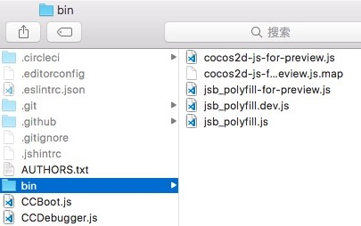
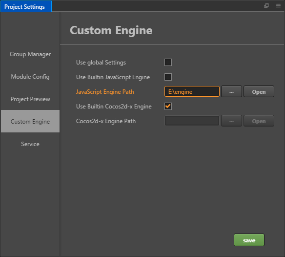
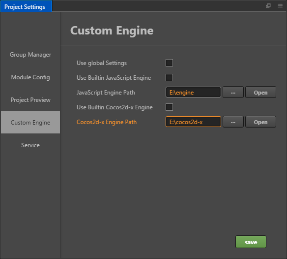

# Engine Customization Workflow

The game engine in Cocos Creator has two parts: JavaScript engine with ECS (entity-component system) and C++ (custom version of Cocos2d-x). They are both open sourced on GitHub:

- Creator-JS engine: <https://github.com/cocos-creator/engine>
- Cocos2d-x-lite engine：<https://github.com/cocos-creator/cocos2d-x-lite>

If you want to customize engine, we recommend that you follow the __fork workflow__ thru GitHub. Please read [GitHub help: Fork A Repo](https://help.github.com/articles/fork-a-repo) to learn the details.

## 1 Customize JavaScript Engine

If your concern is only Web based games, or what you want to change in the engine is not native API, related (for example UI and animation components), you just need to follow the workflow here:

### 1.1 Get JavaScript Engine Repository

First, you need to clone the engine repository or fork the repo. You have to make sure the repo is at the corresponding branch. For example to customize engine for __Cocos Creator v1.6.2__ you'd need to checkout `v1.6` branch; for __Cocos Creator v1.7.1__ you'd need to checkout `v1.7` branch. Once cloning is completed, go to the repo's folder in command-line shell.


### 1.2 Install NPM Dependencies

__npm__ and __gulp__ are core components for engine building. These need to be installed. Example:

```bash
# Enter the engine path in the command line
cd /Users/yufang/engine
# Install the gulp build tool
npm install -g gulp
# Install dependent modules
npm install
```

### 1.3 Change and Build

Now you can do whatever you want to do with the engine, once you finished:

```bash
# build engine
gulp build
```

This command will generate a `bin` folder in the Creator-JS engine directory and compile the engine source into the `bin` directory.



### 1.4 Use customized engine in Cocos Creator

Use the **Custom Engine** tab of the `Project -> Project Settings` panel to set the path to your customized JavaScript engine.



## 2 Customized Cocos2d-x C++ Engine

If you need to change stuff of rendering or native API related function. Besides updating JavaScript engine (so that your change can work with component system) you'll need to synchronize your change to the customized cocos2d-x-lite engine of Cocos Creator. Please make sure you get the cocos2d-x-lite engine repo from the link on top of this article.

Same as JavaScript engine, you need to make sure cocos2d-x-lite repo is on correct branch. For Cocos Creator v1.6.0 please checkout `v1.6` branch.

### 2.1 Initialize

Once cloned, enter the Cocos2d-x-lite engine folder and run:

```bash
# Enter the C++ engine path from the command line
cd /Users/yufang/cocos2d-x-lite
# Install NPM dependencies
npm install
# Initialize repo
gulp init
```

- If you get an error like the one below, please download the zip file manually. The reason for the error is that a python library version is too low, but the upgrade is cumbersome. The simpler method is to download the zip file and manually put it under the C++ engine repo and rename it to `v3-deps-54` (you do not need to unzip the zip file.) and rerun the initialization repo command.

```bash
> ==> Ready to download 'v3-deps-54.zip' from
> 'https://github.com/cocos-creator/cocos2d-x-lite-external/archive/v3-deps-54.zip'
> Traceback (most recent call last):
> ...
> URLError: <urlopen error [SSL: TLSV1_ALERT_PROTOCOL_VERSION] tlsv1 alert protocol version (_ssl.c:590)>
```

- If you get an error like the one below, please manually download the zip file. Manually put it in the C++ engine repository under the `cocos2d-x-lite/tools/cocos2d-console` directory and rename it to `creator-console-2` (without unzipping the zip file), and then rerun the initialize repo command.

```bash
> ==> Ready to download 'creator-console-2.zip' from
> 'https://github.com/cocos2d/console-binary/archive/creator-console-2.zip'
> Traceback (most recent call last):
> ...
> URLError: <urlopen error [SSL: TLSV1_ALERT_PROTOCOL_VERSION] tlsv1 alert protocol version (_ssl.c:590)>
```

### 2.2 Used customized cocos2d-x-lite engine in Cocos Creator

Use the **Custom Engine** tab of the `Project -> Project Settings` panel to set the path to your customized cocos2d-x-lite engine.



### 2.3 Build from Source

Next, you can start working on updating code for Cocos2d-x-lite. If you want to use source code in your built project you can just choose `default` template in **Build** panel and compile from the source, no extra command line work needed.

### 2.4 Build binary library and simulator

- If you want to use a `binary` template to build and compile native project (it's much faster since C++ code are already compiled), you'll need to run these commands:

```bash
# use cocos console to generate prebuilt binary libs
gulp gen-libs
```

- To generate simulator to preview your changes:

```bash
# use cocos console to generate simulator
gulp sign-simulator
gulp gen-simulator
gulp update-simulator-config
```

**Attention**: `gulp sign-simulator` is a new command since 1.7.0. only need to run on **Mac**. It can help you to sign the simulator project in `tools/simulator/frameworks/runtime-src/proj.ios_mac/simulator.xcodeproj`, so you can debug the simulator on Mac. This command will open the XCode project in the background. Then you should set the signing manually, and close XCode to make it finished. If you don't want to sign it, just close XCode directly. You need to rerun this command once the project is changed. See [Build simulator](https://github.com/cocos-creator/cocos2d-x-lite/blob/develop/README.md#git-user-attention) for details.


## 3 JSB Workflow (JavaScript Binding)

If your changes involves JavaScript and C++ changes at the same time. You should read this article:

Creator >= 1.7, please refer to:

- [JSB 2.0 Binding Tutorial](jsb/JSB2.0-learning.md).

Creator <= 1.6, please refer to:

- [Script binding in Cocos](https://zhuanlan.zhihu.com/p/20525026)
- [Automatic binding in Cocos](https://zhuanlan.zhihu.com/p/20525109)