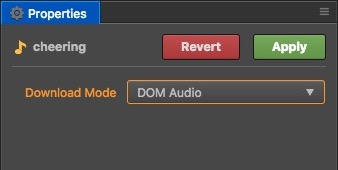

# Audio asset

Audio resources are simple audio files.

Gmae engine plays different sound resources for game background music and sound effects through basic interface of various platforms.

## About the loading mode of sound

Audio loading method only affects the loading effect on the Web. As the implementation of  Web platform is different, so two loading method of sound resources are provided.

### Web Audio


Loading audio resources with Web Audio, the audio resources will be cached in a buffer of the engine.

The advantage of this approach is good compatibility and robust. However the disadvantage is that too much memory will be occupied.

### Dom Audio



By generating a standard element to play the sound resources, the cache is the audio element.

When using standard audio elements to play sound resources, you may encounter some restrictions on some browsers. For example, each play must be played within the user action event (Web Audio only requires the first time), allowing only one sound resource to be played.

For larger Audio such as background music, Dom Audio is recommended.

### Manually choose to load audio by some sort of way

Sometimes we may not use the automatic loading or preload function of the scene, and want to manually control the cc.load resource loading process. We can choose different loading method to load audio resources from url.

#### default mode

The default way to load is Web Audio. The audio element is only used if the browser does not support it.

```js
cc.loader.load(cc.url.raw('resources/background.mp3'), callback);
```

#### dom element mode

1. In the **Assets**, select an audio, the **Properties** will have a choice of load mode

2. Audio in the loading process, will read the url get parameter. Which only need to define a useDom parameter.

    ```js
    cc.loader.load(cc.url.raw('resources/background.mp3?useDom=1'), callback);
    ```
It should be noted that if you use the dom element to load the audio, in the cc.load cache, the cache will also have the url? UseDom = 1

<hr>

Continue on to read about [Prefabricate Asset](prefab.md).