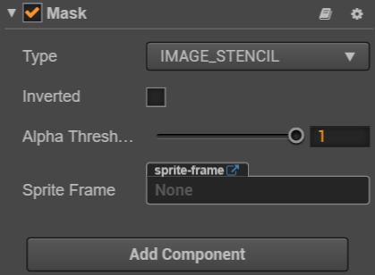

# Mask Component Reference

Mask is used to specify the range where the child node can perform rendering. Nodes with a component that contains Mask will use a bounding box (which has the range specified by 憇ize? of this node to create a rendered mask.  All of the child nodes of this node will clip according to this mask and the area outside the mask won't be rendered.

Click the `add component` button at the bottom of the **Properties** panel and select `Task` from `add rendering component`? You can then add the Mask component to the node.

## Mask attribute

| Attribute |   Function Explanation
| -------------- | ----------- |
| Type           | The mask type [Type API](../../../api/en/enums/Mask.Type.html)
| Inverted       | Boolean,The Reverse mask
| AlphaThreshold | Float, The alpha threshold，The content is drawn only where the stencil have pixel with alpha greater than the alphaThreshold, Only available in IMAGE_STENCIL mode
| SpriteFrame    | The mask image, Only available in IMAGE_STENCIL mode
| Segements      | The segements for ellipse mask, Only available in ELLIPSE mode

## Detailed explanation

After adding the Mask component to a node, all the child nodes of this node will be affected by Mask during rendering.

---

Continue on to read about [ScrollView component reference](scrollview.md).
