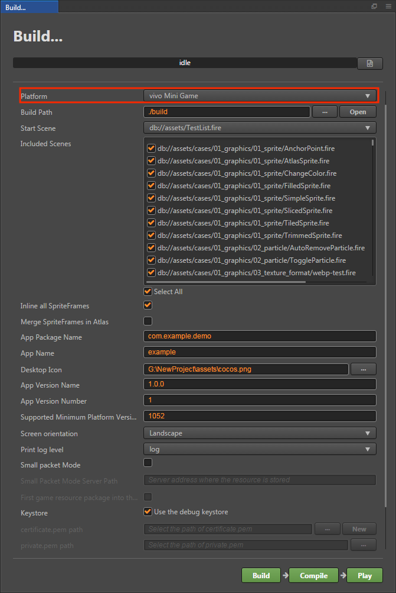

# Publishing to Vivo Mini Games

Starting with __v2.0.5__, Cocos Creator officially supports the release of games to the __Vivo Mini Game__ platform. It takes just a single click with Cocos Creator to publish to the Vivo Mini Game platform.

## Environment Configuration

- Download [Quick App & Vivo Mini Game Debugger](https://dev.vivo.com.cn/documentCenter/doc/163) and [Vivo Mini Game Engine](https://dev.vivo.com.cn/documentCenter/doc/163) and install it on your Android device (recommended Android Phone 6.0 or above)

- Install [nodejs-8.1.4](https://nodejs.org/zh-cn/download/) or above, globally:

    **Note**: After installing nodejs, you need to pay attention to whether the npm source address is https://registry.npmjs.org/

    ```bash
    # View current npm source address
    npm config get registry

    # If not, reset the npm source address
    npm config set registry https://registry.npmjs.org/
    ```

- Install `qgame-toolkit` globally:

    ```bash
    npm install -g qgame-toolkit
    ```

## Release Process

**First**, use __Cocos Creator__ to open the project that needs to be released. Select **Vivo Mini Game** in the **Platform** dropdown of the **Build...** panel.



Where **App Package Name**, **App Name**, **App Icon**, **App Version Name**, **App Version Number**, **Supported Minimum Platform Version Number** (Note: Please fill in **1020**) These parameters are required and filled in according to the user's needs and the prompt information in the parameter input box. The **Small Packet Mode**, **Small Packet Mode Server Path** are optional. For the **Keystore** and two signature files (**certificate.pem path** and **private.pem path**), need to select the **Keystore** or fill in two paths according to user requirements. <br>
The specific filling rules for the relevant parameter configuration are as follows:

- **App icon**

  **App icon** is required. When building, the app icon will be built into the project of the __Vivo Mini Game__ game. Please make sure that the image under the app icon path is true. For example, if the application icon path is `/assets/image/logo.png`, the image directory and logo.png need to exist in the **Assets** directory of __Cocos Creator__ **Explorer**. **App icon** suggest using PNG pictures.

- **Small Packet Mode and Small Packet Mode Server Path**

  This item is optional. The in-package volume of the mini-game contains code and resources that cannot exceed 4M, and resources can be loaded via network requests. **Small Packet Mode** is to help users keep the script files in the small game package, other resources are uploaded to the remote server, and downloaded from the remote server as needed. And the download, cache and version management of remote resources, Cocos Creator has already helped the user. What the user needs to do is the following two steps:

  1. When building, check the **Small Packet Mode** and fill in the **Small Packet Mode Server Path**. Then click on **Build**.

  2. After the build is complete, click the **Open** button after the **Publish Path** to upload the **jsb-link/res** directory under the release path to the packet mode server. For example, if the default publishing path is build, you need to upload the **build/jsb-link/res** directory.

  At this point, the built-up **qgame** directory will no longer contain the **res** directory, and the resources in the **res** directory will be downloaded from the filled **Small Packet Mode Server Path** via the network request.

- **Keystore**

  When you check the **Keystore**, the default is to build the rpk package with a certificate that comes with Creator, which is used only for **debugging**.
  
  If you don't check the **Keystore**, you need to configure the signature files **certificate.pem path** and **private.pem path**, where you build a rpk package that you can **publish directly**. The user can configure two signature files by using the **...** button to the right of the input box.
  
  **Note**: These two signature files are not recommended to be placed in the build directory of the publish package, otherwise the build directory will be emptied each time when it is built, resulting in file loss.
  
  The user can generate the signature files from the command line, as follows:

    - How to generate a release signature

      The user needs to generate the signature file **private.pem**, **certificate.pem** through tools such as openssl. The certificate in the **build/qgame/sign/debug** directory is for debugging purposes only.

      ```bash
      # Generate a signature file with the openssl command tool
      openssl req -newkey rsa:2048 -nodes -keyout private.pem -x509 -days 3650 -out certificate.pem
      ```

      **Note**: The `openssl` tool can be opened directly in the terminal in linux or Mac environment, and in the Windows environment you need to install `openssl` and configure system environment variables.

**Second**, after the relevant parameters of the **Build...** panel are set, click **Build**. After the build is complete, click the **Open** button behind the **Build Path** to open the build release package. You can see that the **qgame** directory is generated under the default release path build directory, which is the exported __Vivo Mini Game__ project directory.


And the rpk package will be generated in the **/build/qgame/dist** directory.


**Third**, run the packaged rpk to your phone. There are two ways to run rpk on your phone:

- **method one**:

    Generate URLs and QR codes using the __Vivo Mini Game Packer Commands__.

    ```bash
    # First assign the command line to the qgame directory
    cd E:\workspace\YourProject\build\qgame

    # Generate URL and QR code
    npm run server
    ```

    Then open the **Quick App & Vivo Mini Game Debugger** that was installed before on your Android device.

    

    Finally, click the **Scan code install** button to copy the URL generated in the first step to the browser, and then directly scan the QR code on the web page to open the **rpk**.

- **Method Two**:

    Copy the generated small game **rpk** file (located in the dist directory of the game project qgame directory) to the mobile phone SD card

    Open the **Quick App & Vivo Mini Game Debugger** that has been installed before on your Android device, click **Local Install**, then find the **rpk** file from your phone SD and select Open.

    
