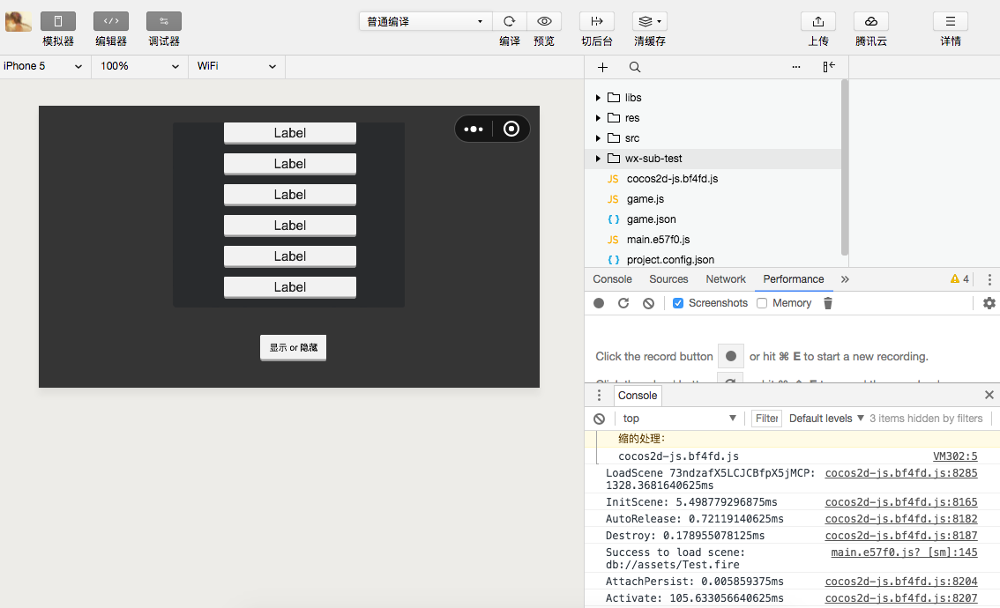

# 接入微信小游戏的子域

微信小游戏为了保护其社交关系链数据，增加了子域的概念，子域又叫 **开放数据域**，是一个单独的游戏执行环境。子域中的资源、引擎、程序，都和主游戏完全隔离，开发者只有在子域中才能访问微信提供的 wx.getFriendCloudStorage() 和 wx.getGroupCloudStorage() 两个 API，用于实现一些例如排行榜的功能。由于子域只能在离屏画布 sharedCanvas 上渲染，因此需要我们把 sharedCanvas 绘制到主域上。

Cocos Creator 从 v1.9.1 版本开始支持打包到子域，下面介绍使用流程。

## 准备工作

由于开放数据域是一个封闭、独立的 JavaScript 作用域，所以开发者需要创建两个项目：

- 主域项目工程（正常的游戏项目）
- 子域项目工程（通过微信 API 获取用户数据来做排行榜等功能的项目）

## 整合方法

- 创建子域项目通过相关的 API 获取用户数据，根据自身需求制作 ui 的展示。
- 主域中通过获取全局对象 sharedCanvas（子域的 Canvas），进行创建 Texture2D ，然后再通过 Texture2D 创建 SpriteFrame，从而把 SpriteFrame 赋值到主域所需要显示到的 Sprite 上，如果子域有操作性功能（例如：滑动，拖拽等之类的操作），那么主域就需要在 update 中实时获取 sharedCanvas 来刷新 Sprite。

**主域代码范例：**

```js
    cc.Class({
        extends: cc.Component,
        properties: {
            display: cc.Sprite
        },
        start () {
            this.tex = new cc.Texture2D();
        },
        // 刷新子域的纹理
        _updateSubDomainCanvas () {
            if (!this.tex) {
                return;
            }
            this.tex.initWithElement(sharedCanvas);
            this.tex.handleLoadedTexture();
            this.display.spriteFrame = new cc.SpriteFrame(this.tex);
        },
        update () {
            this._updateSubDomainCanvas();
        }
    });
```

## 发布步骤 

一、打开主域项目，在 `菜单栏` - `项目` 中打开构建发布面板，选择 `Wechat Game` 平台，填入 [子域代码目录]，该目录是子域构建后所在的路径，并且这个路径需要放在主域构建目录下。然后点击构建。


该步骤会帮用户自动配置到 game.json 中，用于辨别子域文件在主域发布包下的所在目录。


二、打开子域项目，打开构建发布面板，选择 Wechat Game 平台，**渲染模式** 选择 `Canvas` 模式或者 `自动` 模式，并勾选 [小游戏子域工程]，把当前工程打包成子域可用的文件。

三、**发布路径** 设置为主域中填入的 [子域代码目录] 相同路径，即指定到主域项目工程的发布包目录下。

**注意** ：**游戏名称** 必须和主域项目中设置的 [子域代码目录] 名称一致。


或者可以不修改 **发布路径**，在子域项目构建完成后手动将发布包拷贝到主域项目的发布包目录下。如下图所示：


四、在主域项目工程中点击 [运行] 调起微信开发者工具，即可按照之前微信小游戏的正常流程进行发布和调试。



## 参考链接

Cocos Creator 提供的 [子域范例工程](https://github.com/cocos-creator/demo-wechat-subdomain/archive/1.x.zip) 包含了微信子域的使用示例。

[微信官方文档：关系链数据使用指南](https://developers.weixin.qq.com/minigame/dev/tutorial/open-ability/open-data.html) 