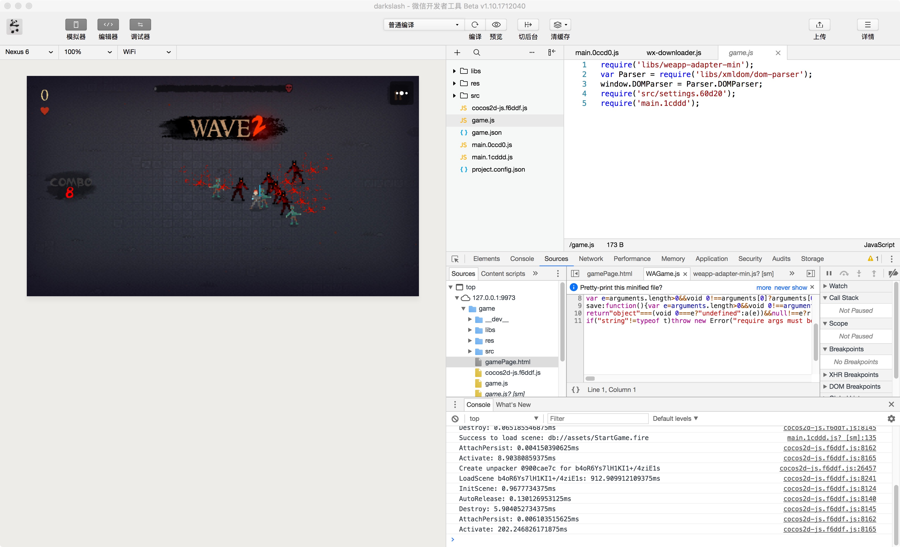
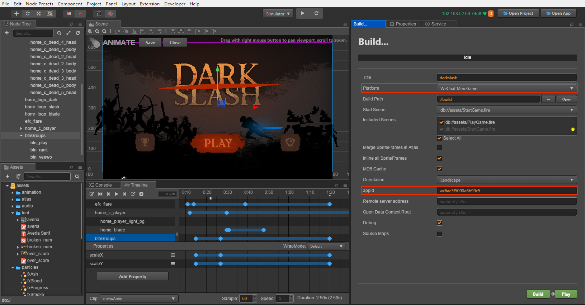
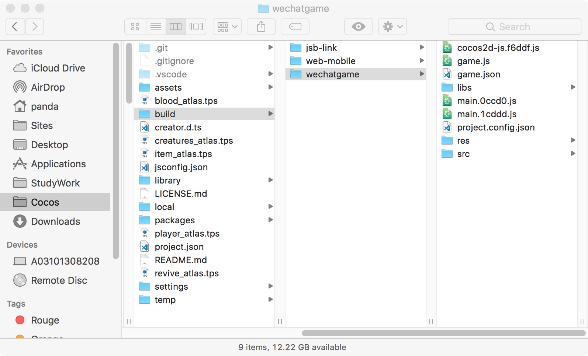
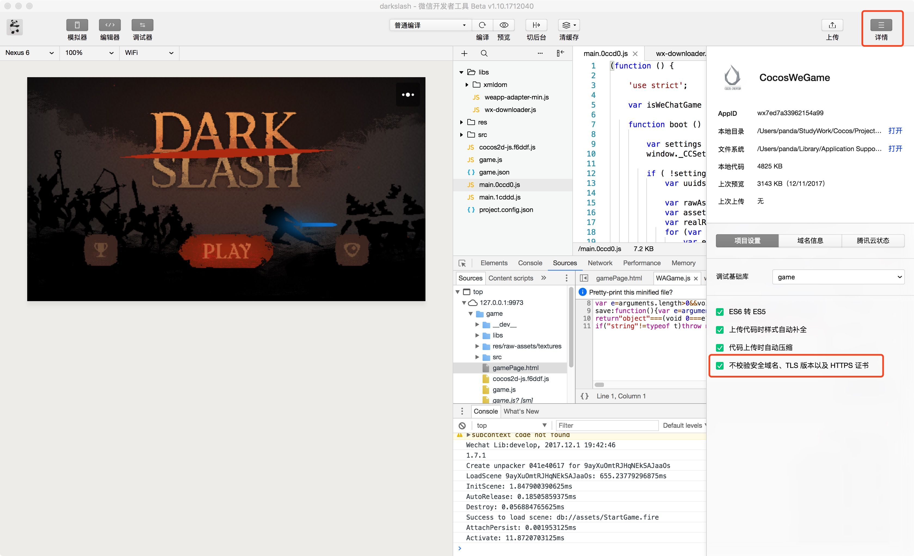

# Publishing to __WeChat Mini Games__

**Note:** there is also a [teaching video](https://v.qq.com/iframe/player.html?vid=c05255stri7&tiny=0&auto=0) that can be used alongside this document.

## __WeChat Mini Game__ Platform

__WeChat Mini Game__ is a game product platform used inside the __WeChat Mini Program__ platform. It not only provides powerful game capabilities, but also provides a large number of native interfaces, such as *payment*, *social*, *file system*, *photo*, *NFC*, and many more. It is equivalent to combining the advantages of the web for easy dissemination and rich native features.

The running environment of the __WeChat Mini Game__ is an extension of the mini program environment. The basic idea is to provide the necessary web interface to the user, and pursue the same development experience as the web. The __WeChat Mini Game__ provides a wrapper around the WebGL interface based on the mini program environment, which greatly improves the rendering capabilities and performance. However, since these interfaces are encapsulated by the __WeChat__ team they are not equivalent to the browser environment. Regarding the game aspect, the current __WeChat Mini Game__ environment provides the rendering interface of __Canvas__ and __WebGL__. The two rendering modes of the __Cocos Creator__ engine can be run, but for performance reasons, we use __WebGL__ to render the game content by default. Developers are strongly recommended to do the same. Also, developers should not modify the default configuration!

As an engine, in order to simplify the developer's workload as much as possible, the main tasks we have done for our users include:

- The engine framework adapts to the WeChat Mini Game API, pure game logic level, users do not need any additional modifications.
- __Cocos Creator__ editor provides a fast packaging process, released directly as a __WeChat Mini Game__, and automatically evokes the developer tools of the mini game.
- Automatic loading of remote resources, cache resources and cache resource versioning.

In addition, the game submission, review and release process of the __WeChat Mini Game__ platform is no different from the __WeChat Mini Program__ platform. They all need to comply with the requirements and standard processes of the __WeChat__ team. For details, please refer to the link at the end of the article.

## Using Cocos Creator to publish WeChat Mini Games

We started with __Cocos Creator__ v1.8 and support __WeChat Mini Games__  with just one-click to publish! Here are the detailed release steps:

1. Download WeChat Developer Tools on [WeChat Public Platform](https://developers.weixin.qq.com/miniprogram/en/dev/devtools/download.html)
2. Set the WeChat Developer Tools path in __Cocos Creator__, "Settings" > "Native Develop"

    
3. Log in to the WeChat public platform and find the appid

    
4. Set the project name and appid in the build panel

    
5. Build
6. Click play to open the WeChat Developer Tools

    
7. Preview deployment

According to this process, a release package of __WeChat Mini Games__ will be generated under the project's build directory, which already contains the configuration files of the __WeChat_Mini Game__ environment: __game.json__ and __project.config.json__

## Resource Management for WeChat Mini Game Environment

In a __WeChat Mini Game__ environment, resource management is the most special part. It differs from the browser in the following four points:

1. The size of the __WeChat Mini Game's__ package cannot exceed __4mb__, including all the code and resources. Additional resources must be downloaded through the network.
2. For files downloaded from a remote server, the __WeChat Mini Game__ environment does not have a browser cache and an expired update mechanism.
3. For the resources in the __WeChat Mini Game__ package, the game environment is not loaded on demand, but all the resources in the package are loaded at one time, and then the page is started.
4. It is not possible to download script files from a remote server.

This brings up two key issues, first page loading speed and remote resource caching and version management. For the first page loading speed, we recommend that users only save the script file in the __WeChat Mini Game__ package, and other resources are downloaded from the remote server. The download, cache and version management of remote resources, in __Cocos Creator__, has already helped users. Let me explain the logic of this part.

In the __WeChat Mini Game__ environment, we provide a __wxDownloader__ object, after setting the `REMOTE_SERVER_ROOT` property, the logic of the engine downloading the resource becomes:

1. Check if the resource is in the mini game pack
2. Query local cache resources if they do not exist
3. Download from a remote server if there is no cache
4. After downloading, save it to the game application cache for re-access.

At the same time, when the md5Cache function of the engine is enabled, the url of the file will change as the content of the file changes. When the game releases a new version, the resources of the old version will naturally become invalid in the cache, and only new requests can be requested from the server. Resources also achieve the effect of version control.

Specifically, developers need to do:

1. When building, check the md5Cache function.
2. Upload the res folder in the mini-game distribution package to the server.
3. Delete the res folder inside the distribution package.
4. Set `Remote Service Address` in the build release panel.
5. For the test phase, you may not be able to deploy to the official server, you need to use the local server to test, then open the details page in the WeChat Developer tool, check the __Do not verify the security domain name, TLS version and the HTTPS certificate__ option in the project settings .

## Platform SDK Access

In addition to pure game content, the __WeChat Mini Game__ environment also provides a very powerful native SDK interface, the most important of which is user, social, payment, etc. These interfaces are only found in the __WeChat Mini Game__ environment, equivalent to other Third-party SDK interface for the platform. The porting of such SDK interfaces still needs to be handled by developers at this stage. Here are some of the powerful SDK capabilities provided by the __WeChat Mini Games__ environment:

1. User interface: login, authorization, user information, etc.
2. WeChat payment
3. Forward and get forwarding information
4. File upload and download
5. Media: pictures, recordings, cameras, etc.
6. Other: location, device information, scan code, NFC, etc.

## Access to the subdomain of WeChat Mini Games

In order to protect its social relationship chain data, __WeChat Mini Games__ has added the concept of subdomain, which is also called **Open Data Domain**, which is a separate game execution environment. The resources, engines, and programs in the subdomain are completely isolated from the main game. Developers can only access the __wx.getFriendCloudStorage()__ and __wx.getGroupCloudStorage()__ APIs provided by __WeChat__ in the subdomain to implement some rankings, for example.

__Cocos Creator__ supports packaging to subdomains starting with __v1.9.1__. For details, please refer to [Access to the subdomain of WeChat Mini Game](../publish/publish-wechatgame-sub-domain.md).

## Reading

- [WeChat Mini Game development documentation](https://developers.weixin.qq.com/miniprogram/en/dev/index.html)
- [WeChat Public Platform](https://mp.weixin.qq.com/?lang=en_US)
- [Mini Program API Documentation](https://developers.weixin.qq.com/miniprogram/en/dev/api/index.html)
- [WeChat Developer Tools Download](https://developers.weixin.qq.com/miniprogram/en/dev/devtools/download.html)
- [WeChat Developer Tools Documentation](https://developers.weixin.qq.com/minigame/en/dev/devtools/devtools.html)

## F.A.Q

Frequently asked questions during the development of __WeChat Mini Games__, are available in this [post](https://forum.cocos.com/t/faq/54828).
