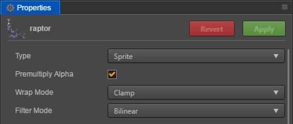
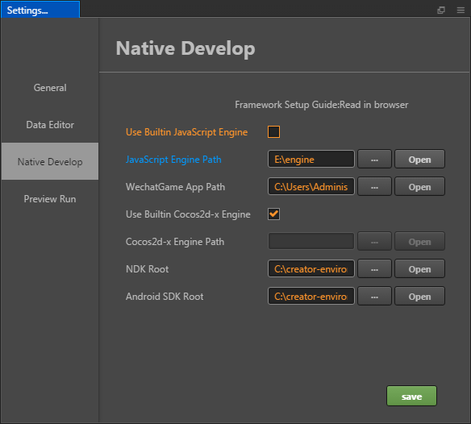
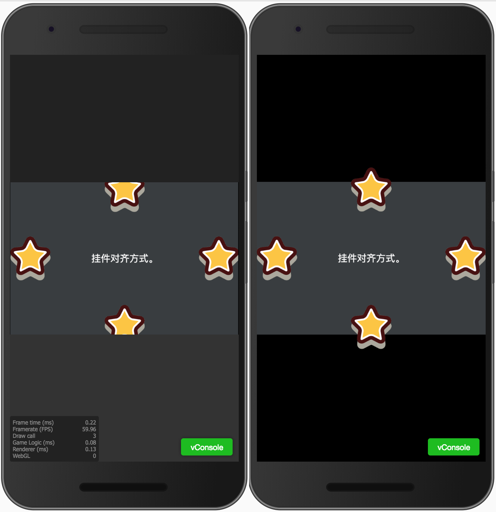

# Cocos Creator v2.0 Upgrade Guide

# 1 Overview

__Cocos Creator v2.0__ is the result of a large-scale *under the hood* refactoring plus two months of
stability testing. This article will assist __v1.x__ users in upgrading to __v2.0__.

In general, the core goals of the Cocos Creator v2.0 design were twofold:

1. Significantly improve the engine performance
2. Provide more advanced rendering capabilities and richer rendering customization options

In order to accomplish this goal, we completely rewrote the underlying renderer, which structurally guarantees performance improvements and rendering capabilities. At the same time, in order to ensure that users project can be upgraded more smoothly, we have almost no changes to the API of the component layer. Of course, these changes are not completely transparent to the user, such as the engine loading process, the event system, the streamlining and reorganization of the engine's overall API, which will have an impact on the user-level API.

If you want to have a quick understanding, you can watch the Cocos Creator v2.0 introduction video first.

Of course, the upgrade is just the beginning, Cocos Creator has prepared more in-depth updates and features coming in updates to the v2.x version.

## 2.0.0 List of known issues

Since many users have feedback on the problems encountered in upgrading from 1.x, we also need to highlight the risks of the current upgrade, the problems, and the plan to fix these issues.

List of known issues:

  1. Particle resources with built-in base64 texture may fail during 1.x upgrade. We will roll back the upgrade of the Particle resource in 2.0.1 and return to the 1.x state to avoid errors. If you encounter a similar problem, you can bypass it by using an external map file.
  2. 1.x RichText upgrade may cause the scene to continue to report error: __can not read property `_worldMatrix` of null__. Will be fixed in 2.0.1. Temporarily you can remove RichText in the old version and then add it again in 2.0 to bypass it.
  3. The remote avatar loaded in the WeChat open data field cannot be displayed, and the camera background color cannot be set. Fixed in 2.0.1.
  4. Playing a release version may be blacked out because the script file name case under libs is overwritten during the release process. Fixed in 2.0.1. If you encounter problems, please use the 1.x version to play.
  5. Some Spine animations are rendered incorrectly after the upgrade. Fixed in 2.0.1.
  6. Using Tilemap with Camera zoom, there will be problems with the map being oversized. Fixed in 2.0.1.
  7. RichText does not support color modification by node color.
  8. Native platform does not support VideoPlayer and WebView components at this time
  9. IE 11 is not supported. Fixed in 2.0.1.

# 2. Editor upgrade

Let's take a look at the changes at the editor level. Since the focus of v2.0 is focused on the engine level, there are actually not many changes in this area. They are mainly texture resources, platform release, and the use of some components. In future versions of v2.x, editor level upgrades will be released.

## 2.1 Texture Resource Configuration

Maybe developers have noticed the configuration of texture resources in Creator 1.x, such as Wrap Mode and Filter Mode, but in fact, no matter how you set it in 1.x, it will not affect the runtime texture resources. So in 2.0, we made these configurations take effect at runtime, and we also added an option to prefetch textures:

- __Wrap Mode:__ Loop mode, which determines how the texture is sampled when uv exceeds 1.
  - __Clamp:__ the value of __uv__ is automatically limited to __0, 1__ and exceeds __0 or 1__ directly.
  - __Repeat:__ When over, the value of __uv__ is modulo, so that the texture can be rendered in a loop.
- __Filter Mode:__ Filter mode, which determines whether to blend the surrounding pixels with the surrounding pixels when floating point samples are used to achieve the smoothing effect of texture scaling. In effect, Trilinear smoothness is higher than Bilinear, higher than Point, but Point is very suitable for pixel-style games. When scaling textures, the pixel boundaries will not be blurred, maintaining the original pixel painting style.
  - __Point (nearest point sampling):__ directly use the nearest pixel on the uv value
  - __Bilinear (secondary linear filtering):__ take the average of the pixel corresponding to uv and the surrounding four pixels
  - __Trilinear (triangular linear filtering):__ Based on the quadratic linear filtering, the quadratic linear filtering results of two adjacent mipmaps are taken for the mean calculation.
- __Premultiply Alpha:__ This is a new parameter in 2.0. When checked, the engine will enable the GL pre-multiply option during the upload of the GPU map. This is very helpful for some textures that need to be pre-multiplied. Often there are some users who can't understand the inexplicable white edges around the texture or around the text, which is caused by the semi-transparent pixels around the texture:

![Spine's strange white edges at the bone seams] (upgrade-guide-v2.0/spine-border.png)

This can be eliminated by using code in 1.x, and in 2.0 you only need to turn on the pre-multiply option of the texture. It's also worth noting that if you find that this makes the texture darker, you can change the blending mode of the corresponding rendering component to ONE, ONE_MINUS_SRC_ALPHA.

## 2.2 RenderComponent component settings

In 2.0, we abstracted a new base component class: `RenderComponent`, and all direct rendering components are inherited from this component. These include: `Sprite`, `Label`, `Graphics`, and so on. The most intuitive change for the user is that the rendering component that inherits from it will include the __Src Blend Factor__ & __Dst Blend Factor__ in the __Property inspector__:

![TiledLayer's Mixed Mode Settings] (upgrade-guide-v2.0/render-component.png)

Because of the transformation of the underlying renderer in 2.0, we abstracted the functionality of many render phases for user access and setup. Many of the interfaces to these interfaces are in the RenderComponent. In addition to the blend mode, we also plan to introduce the material system (the engine is built-in, and only the script interface is temporarily available).

## 2.3 Camera component use

The camera may be the most changed component from 1.x to 2.0. In order for developers to update smoothly, we tried to maintain the consistency of the component layer API. Here are details of the changes:

  1. The `Canvas` component adds a default *Main Camera* node and mounts the `Camera` component, which will default to the center of the `Canvas` node, showing the rendered elements in the scene.
  2. `Node` Group corresponds to Camera's culling mask, only the Group contained in Camera culling mask will be rendered.
  3. You can render different groups through multiple cameras, and let them have a global hierarchical relationship. Scene rendering is based on the Camera list, which is rendered in turn (multi-camera can also render the same object with different perspectives)

If you need a more advanced Camera component, it will be necessary to upgrade to v2.0. It is not possible to directly specify the target corresponding to Camera. Instead, set the node and camera matching relationship by setting the culling mask of node Group and Camera.

For specific changes, developers can refer to [2.0 Camera Using Documentation] (../render/camera.md).

## 2.4 Build Panel Updates

The biggest change in Build panels is the release of WeChat games open data domain. In 1.x, developers choose to publish the platform as Wechat Game and check the open data domain project. In 2.0, we separate the WeChat open data domain into a platform: Wechat Game Open Data Context.

![2.0 WeChat game open data domain publishing panel] (upgrade-guide-v2.0/wechat-open-data.png)

As you can see, the build options are much simpler than other platforms because the open data domain has a special environment that removes unnecessary options. At the same time, since the open data domain does not support WebGL rendering, the WebGL renderer will be rejected on the engine module clipping, regardless of the user's settings, and all modules that rely on WebGL rendering will be rejected. Other modules still need the user's own choice to try to get the smallest package in the open data domain.

For the same reason, when building other platforms, please don't check the Canvas Renderer, because the Canvas renderer supports a small number of rendering components, meaning little.

Starting with v2.0.1, we updated the open data domain solution. For details, please refer to [Access Small Game Open Data Domain] (../publish/publish-wechatgame-sub-domain.md).

## 2.5 Module Settings

In addition to the special module settings in the WeChat open data domain, there are several points to note in the module settings of other platform projects:

  1. Currently we have deprecated the Canvas rendering mode on other platforms in the non-WeChat open data domain, so the Canvas Renderer module can be culled, but the WebGL Renderer module must be retained.
  2. The native platform cannot currently remove the Native Network module (which will be adjusted in the future).

## 2.6 Custom Engine Quick Compile

In 2.0, we provided a more convenient way for developers who needed a custom engine. 1.x After modifying the custom engine, you also need to build the gulp build to take effect, and the build time is very long. The root cause of this problem is that any minor changes require repackaging and confusing all engine files, which can take a long time. So in 2.0, we instead refer to the separated source files in the custom engine. When the user changes, only the modified file will be updated, and the developer can also manually trigger the update.

When using a custom JS engine:

  1. Check Automatically compile JS engine: scan engine and automatically recompile modified engine code when loading or refreshing editor
  2. Uncheck the automatic compilation of the JS engine: the developer needs to manually use the menu item: __developer__ > __compilation engine__ to trigger the compilation after modifying the engine code.

After the compilation is complete, the preview will use the new engine code directly. When the project is built, it will also be compiled and built with the new engine code. Of course, this will bring two side effects: the build time needs to be compiled when the engine is compiled; There are a lot of load engine scripts, so the preview load time will also grow.

# 3. Engine upgrades

We have completely upgraded the engine framework in 2.0. Here are the most important pieces:

  1. Even more modular
  2. Remove the underlying cocos2d-html5 rendering engine and now share the underlying renderer with the 3D engine
  3. Discard the render tree and assemble the rendered data directly using nodes and render component data.
  4. Logic layer and render layer are isolated, interacting through limited data types
  5. Rendering process zero garbage

The specific updates are described below.

## 3.1 Underlay Renderer Upgrade

In general, users control rendering by rendering component levels. For this type of usage, there is almost no difference between 2.0 and 1.x. The code of the component layer after upgrading still works the same. However, if the user touches the __sgNode level__ in their project code due to optimization or other requirements, then it should be noted that the **_ccsg module** as the underlying renderer in 1.x has been completely removed, and the component layer can no longer access any of them. Here are the differences between 2.0 and 1.x at the node tree level:

Another key point is that in addition to retaining limited Canvas rendering capabilities in the WeChat open data domain, other platforms have removed Canvas rendering and only support WebGL rendering.

Due to space limitations, we do not delve into the update of the underlying framework of the engine. For details, please pay attention to our subsequent v2.0 rendering framework documentation.

## 3.2 Startup process changes

In 1.x, the order in which the engine and user scripts are loaded is:

  - Load the engine
  - load `main.js`
  - Initialize the engine
  - Initialize the renderer
  - Load project plugin script
  - Load project main script
  - Call `cc.game.onStart`

In 2.0, the user script can intervene into the initialization logic, such as setting `cc.macro.ENABLE_TRANSPARENT_CANVAS` (whether the Canvas background is transparent), `cc.macro.ENABLE_WEBGL_ANTIALIAS` (whether to enable WebGL anti-aliasing), or applying some pre-customization to the engine. Code. Previously these jobs had to be customized with `main.js`, added in the `cc.game.onStart` callback, mixed with the engine's default initialization logic, users often confused, and not friendly to version upgrades.
So in 2.0 we preloaded the loading of user scripts:

  - Load the engine
  - load `main.js`
  - Load project plugin script
  - Load project main script
  - Initialization Engine (Animation Manager, Collision Manager, Physics Manager, Widget Manager)
  - Initialize the renderer
  - Call `cc.game`.onStart

## 3.3 平台代码分离和定制

在 1.x 中，main.js 承载了所有平台的初始化逻辑，但由于平台越来越多，差异也越来越大，所以我们决定将这些平台的启动逻辑尽量分离。

1. Web & Facebook Instant Game
    1. 入口文件：index.html
    2. 适配文件：无
2. 微信小游戏
    1. 入口文件：game.js
    2. 适配文件：libs/
3. 原生平台
    1. 入口文件：main.js
    2. 适配文件：jsb-adapter/
4. QQ 轻游戏
    1. 入口文件：main.js
    2. 适配文件：libs/

开发者如果需要添加自己的定制代码，可以参考[定制项目文档](http://docs.cocos.com/creator/manual/zh/publish/custom-project-build-template.html)在项目中用自己的版本覆盖原始版本，另外，尽量不要覆盖 main.js。

## 3.4 事件系统升级

事件系统在引擎和用户代码中都被广泛使用，但是为了兼容派发触摸事件的需求（捕获和冒泡），1.x 中它的设计过于复杂，对于普通的简单事件反而性能有些低下。在 2.0 中为了解决这个问题，我们将树形结构中包含捕获和冒泡阶段的事件模型仅实现在了 cc.Node 中，彻底简化了 EventTarget 的设计。下面是关键的 API 对比：

Node：

- on (type, callback, target, useCapture)：注册事件监听器，可以选择注册冒泡阶段或者捕获阶段
- off (type, callback, target, useCapture)：取消注册监听器
- emit (type, arg1, arg2, arg3, arg4, arg5)：派发简单事件
- dispatchEvent (event)：以捕获和冒泡事件模型在节点树上派发事件（捕获阶段触发顺序从根节点到目标节点，冒泡阶段再从目标节点上传到根节点）

EventTarget：

- on (type, callback, target)：注册事件监听器
- off (type, callback, target)：取消注册监听器
- emit (type, arg1, arg2, arg3, arg4, arg5)：派发简单事件
- dispatchEvent (event)：兼容 API，派发一个简单的事件对象

可以看到只有 Node 的 `on`/`off` 支持父节点链上的事件捕获和事件冒泡，默认仅有系统事件支持这样的派发模式，用户可以通过 `node.dispatchEvent` 在节点树上以同样的流程派发事件。这点跟 1.x 是一致的。
但是，Node 上使用 emit 派发的事件和 EventTarget 上的所有事件派发都是简单的事件派发方式，这种方式派发的事件，在事件回调的参数上和 1.x 有区别：

    // v1.x
    eventTarget.on(type, function (event) {
        // 通过 event.detail 获取 emit 时传递的参数
    });
    eventTarget.emit(type, message); // message 会被保存在回调函数的 event 参数的 detail 属性上
    // v2.0
    eventTarget.on(type, function (message, target) {
        // 直接通过回调参数来获取 emit 时传递的事件参数
    });
    eventTarget.emit(type, message, eventTarget); // emit 时可以传递至多五个额外参数，都会被扁平的直接传递给回调函数

另外值得一提的是，热更新管理器的事件监听机制也升级了，AssetsManager 在旧版本中需要通过 cc.eventManager 来监听回调，在 2.0 中我们提供了更简单的方式：

    // 设置事件回调
    assetsManager.setEventCallback(this.updateCallback.bind(this));
    // 取消事件回调
    assetsManager.setEventCallback(null);

## 3.5 适配模式升级

Cocos Creator 支持多种适配模式，开发者可以通过 Canvas 组件中的设置来管理，其中一种适配模式在 2.0 中有一定的调整，就是同时勾选 Fit Width 和 Fit Height 的模式。

在这种适配模式下，开发者的设计分辨率比例将会忠实地被保留，并缩放场景到所有内容都可见，此时场景长宽比和设备屏幕长宽比一般都存在差距，就会在左右或者上下留下黑边。在 1.x 中，我们将 DOM Canvas 的尺寸直接设置为场景的尺寸，所以超出场景范围的内容都会被剪裁掉，而背景就是 Web 页面。但是这种方式在微信小游戏上遇到了问题，微信会强制将主 Canvas 的尺寸拉伸到全屏范围，导致 1.x 使用这种适配模式在小游戏上往往都会造成严重的失真。2.0 改变了适配策略的实现，保持 DOM Canvas 全屏，通过设置 GL Viewport 来让场景内容居中，并处于正确位置。这样做带来的变化是，微信小游戏中比例完全正确，但是场景范围外的内容仍然是可见的。

## 3.6 RenderTexture 截图功能

在 1.x 中，开发者一般通过 cc.RenderTexture 来完成截图功能，但是这是属于旧版本渲染树中的一个功能，在我们去除渲染树后，截图功能的使用方式也完全不同了。简单来说，2.0 中 cc.RenderTexture 变成了一个资源类型，继承自贴图（cc.Texture）资源。开发者通过将某个摄像机内容渲染到 cc.RenderTexture 资源上完成截图，具体的使用方式参考 [Camera 文档截图章节](../render/camera.html#%E6%88%AA%E5%9B%BE)。

## 3.7 TiledMap 功能简化

瓦片地图在 2.0 中经过了重新设计，为了提升渲染性能，我们简化了 TiledLayer 的能力，下面是修改或去除的 TiledLayer 功能：

- ~~getTiles~~
- ~~setTiles~~
- getTileAt: getTiledTileAt
- ~~removeTileAt~~
- setTileGID: setTileGIDAt
- ~~setMapTileSize~~
- ~~setLayerSize~~
- ~~setLayerOrientation~~
- ~~setContentSize~~
- ~~setTileOpacity~~
- ~~releaseMap~~

我们去除了 Tiles 获取和设置的能力，设置 map 或者 layer 尺寸和朝向的能力，这是因为我们希望这些信息从 tmx 文件中获取之后是稳定的，开发者可以通过 tmx 去调整地图，而不是这些接口。在 1.x 中，getTileAt 和 setTileAt 是通过将一个地图块实例化为一个 Sprite 实现的，这个 Sprite 的渲染在地图的渲染流程中会制造大量的特殊处理逻辑，也会使得瓦片地图渲染性能受到比较大的影响。所以在 2.0 中，我们提供了 getTiledTileAt 接口让开发者可以获取一个挂载 TiledTile 组件的节点，通过这个节点，开发者可以修改 Tile 的位置、旋转、缩放、透明度、颜色等信息，还可以通过 TiledTile 组件来控制地图位置和瓦片 ID，这取代了原本的 setTileOpacity 等独立接口。

当然，我们不是为了简化而简化，一方面这带来了性能上的提升，另一方面这个简单的框架也为未来瓦片地图的升级打下了很好的基础，我们计划会支持 multiple tilesets、节点遮挡控制等能力。

## 3.8 物理引擎升级

物理引擎方面，我们将旧的 box2d 库升级为 [box2d.ts](https://github.com/flyover/box2d.ts)，主要是为了在性能上有所提升，保障物理游戏的稳定性。不过 box2d.ts 内部的接口和以往的接口会有一定的差异，开发者需要留意这些接口的使用。

## 3.9 其他重要更新

除了上面那些完整模块的更新，在引擎的其他方面还有一些比较重要的更新：

1. Node
    1. 移除了 tag 相关的 API
    2. 将 transform 获取 API 都更新为 matrix 相关 API，并且获取时需要开发者传递存储结果的对象
    3. 保留属性风格 API，移除与属性重复的 getter setter API
    4. 由于遍历流程的改变，节点的渲染顺序也和之前不同，2.0 中所有子节点都会在父节点之后渲染，包含 zIndex 小于 0 的节点
2. Director
    1. 移除了与视图和渲染相关的 API，比如 getWinSize、getVisibleSize、setDepthTest、setClearColor、setProjection 等
    2. 废弃 EVENT_BEFORE_VISIT 和 EVENT_AFTER_VISIT 事件类型
3. Scheduler：除了组件对象以外，需要使用 Scheduler 调度的目标对象，都需要先执行 `scheduler.enableForTarget(target)`
4. value types
    1. 以前在 cc 命名空间下的 AffineTransform 计算 API 都移到 AffineTransform 下，比如 `cc.affineTransformConcat` 改为 `cc.AffineTransform.concat`
    2. Rect 和 Point 相关的计算 API 都改为了对象 API，比如 `cc.pAdd(p1, p2)` 改为 `p1.add(p2)`
    3. 移除了 `cc.rand`、`cc.randomMinus1To1` 等 JS 直接提供的 API
5. debug：新增 cc.debug 模块，暂时包含 setDisplayStats、isDisplayStats 方法
6. 移除的部分重要 API
    1. 所有 _ccsg 命名空间下的 API
    2. cc.textureCache
    3. cc.pool
    4. Spine：Skeleton.setAnimationListener

除了上面这些升级，对于引擎核心模块来说，我们将所有的 API 变更都记录在了 [deprecated.js](https://github.com/cocos-creator/engine/blob/2.0.0/cocos2d/deprecated.js) 中，在预览或者调试模式中，开发者都会看到相关的 API 更新提示，只要按照提示进行升级，再结合这篇文档，相信就可以解决大部分问题。

# 4. 后续版本计划

2.0 虽然已经完成了底层渲染器的更新，但是我们尚未正式开放高级渲染能力给开发者，在 2.x 后续版本中，我们会逐步用产品化的方式推出这些高渲染能力，让开发者们可以在用 Cocos Creator 制作 2D 游戏时，感受到前所未有的想象空间，释放无限的创作激情。

大致的路线图规划如下：

