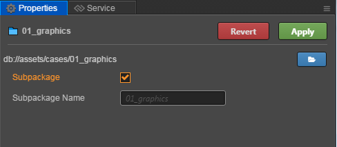
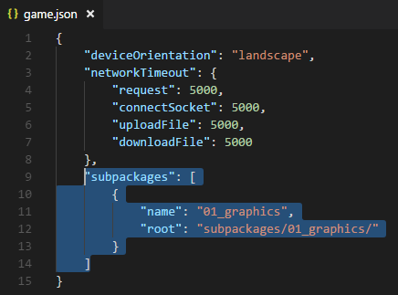
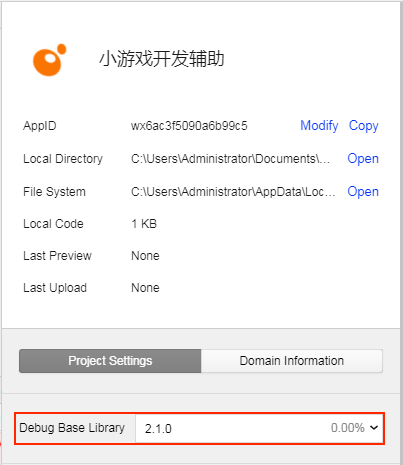

# Code Sub-packaging

As gameplay becomes more and more rich, the amount of code in the game is increasing and developers are wanting to expand the size of their game package. **Code sub-packaging** provides for these demands.

**Sub-package** loading, is the the game content being split into several packages according to certain rules. During the first startup, only the necessary packages are downloaded, also called the **main package**. Other sub-packages are downloaded, as triggered, which can effectively reduce the time spent on the first boot.

## Configuration method

__Cocos Creator's__ uses a folder structure when configuring a **sub-package**. When a folder is selected, the relevant configuration options for the folder appear in the **Properties** tab:



After checking **Config as subpackage**, click `Apply` at the top right, and the code in this folder will be treated as the contents of the __sub-package__. The __sub-package__ name will be passed as the loaded name when the __sub-package__ is loaded. The name of this folder will be used by default.

## Building

The function of **code sub-packaging** will only be avialable after the project is built. When previewing, it will be loaded according to the whole package. After the project is built, the corresponding **sub-package** file will be generated in `src/assets` in the release package directory.

**For example:** Configuring the `cases/01_graphics` folder in the example project as a **sub-package**. The `01_graphics.js` file will be generated in `src/assets/cases` in the release package directory after the project is built.

then the project will build a `src\assets/cases` generated `01_graphics.js` file in the release package directory. The file name is not replaced with the replacement of the **sub-package** name. The `01_graphics.js` file contains all the code in the `01_graphics` folder and will be removed from the **main package**.


When building for the **WeChat Mini Game Platform**, the configuration of the **sub-package** will be automatically generated into the `game.json` configuration file of the **WeChat Mini Game** release package according to the rules.



**Note:** **WeChat Mini Games** require a specific version to support the **sub-package** feature.
> WeChat 6.6.7 Client, 2.1.0 and above base library support, please update to the latest client version, developer tools please use version *1.02.1806120* and above

After updating the developer tools, don't forget to modify the version of __Details -> Project Settings -> Debug Base library__ to __2.1.0__ and above in the developer tools:



Please refer to the [WeChat Sub-Package Loading](https://developers.weixin.qq.com/minigame/en/dev/tutorial/base/subpackages.html) documentation for details.

## Loading a Sub-Package

The engine provides a unified api `cc.loader.downloader.loadSubpackage` to load the **sub-package** code for all platforms. `loadSubpackage` needs to pass in the name of a **sub-package**. This name is the name of the **sub-package** that you configured in the project before. The default is the name of the **sub-package** folder.

When the **sub-package** is completed, a callback is triggered, and if the loading fails, an error message is returned.

```javascript
cc.loader.downloader.loadSubpackage('01_graphics', function (err) {
    If (err) {
        return console.error(err);
    }
    console.log('load subpackage successfully.');
});
```
