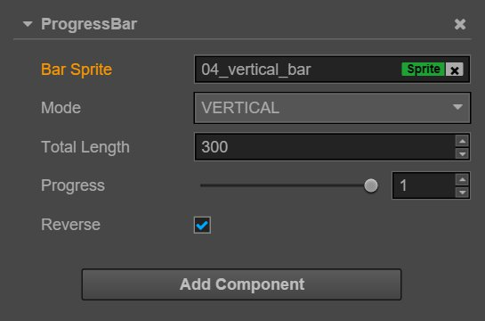

# ProgressBar component reference

ProgressBar is usually used to show the progress of a certain operation in the game. Add the ProgressBar component to a node and associate a
Bar Sprite to this component. The Bar Sprite can then be controlled to show progress in the scene.

Click the `add component` button at the bottom of the **Properties** panel and select `ProgressBar` from `add UI component`? You can then add the ProgressBar component to the node.

## ProgressBar attribute

| Attribute |   Function Explanation
| -------------- | ----------- |
| Bar Sprite | The Sprite component needed for rendering ProgressBar. It can be linked by dragging a node with the `Sprite` component to this attribute.
| Mode | Currently supports the horizontal and vertical modes. The initial direction can be changed by cooperating with the `Reverse` attribute.
| Total Length | The total length/total width of the Bar Sprite when the ProgressBar is at 100%.
|Progress | Floating point. The data range is 0~1; values beyond that are not allowed.
|Reverse | Boolean value. The default filling direction is from left to right/bottom to top. You can switch between the two after it has been opened.

## Detailed explanation

After adding the ProgressBar component, drag a node with the `Sprite` component from the **Node Tree** to the Bar Sprite attribute. You can then control the display of the ProgressBar by dragging the progress sliding block.

Bar Sprite could be its own node, child node or any node that comes with the `Sprite` component. Also, Bar Sprite can freely choose the Simple or
Sliced rendering modes.

---

Continue on to read about [Mask component reference](mask.md).
