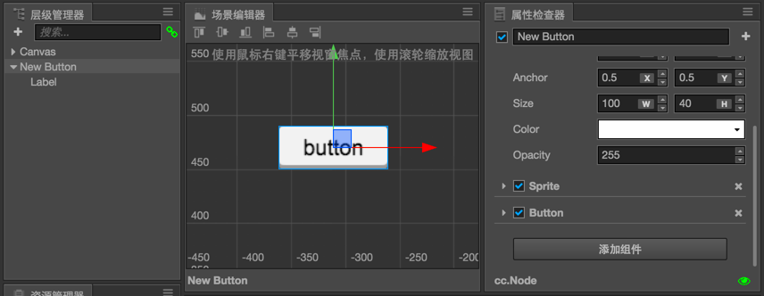
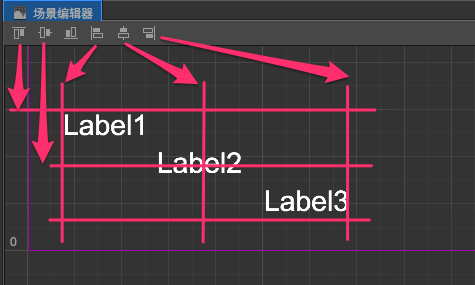
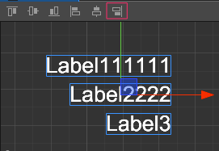

# Build scene graph with scene editor

This section will introduce the workflow and tips of using **Scene**  panel to create and editing scenes.

## Use Canvas as root node for all renderers

Newly created scene will have a `Canvas` node by default, it serves as the recommended root node for all renderer nodes. This has the below advantages:

- `Canvas` will fit the screen resolution automatically, use it as the root node will provide a solid screen size reference to all the renderer node in scene. Please read [Auto fit for multi-resolution](../ui/multi-resolution.md) to learn details.
- `Canvas` default anchor point is at `(0.5, 0.5)` and `Canvas` node will fit the screen size so any node under `Canvas` will use the screen center as the origin. This will make scene and UI building easy (for example create a button with label at the center), it also makes positioning nodes with scripting much easier.

If you don't like using `Canvas` to make coordinate system's origin at the center of screen, you can also delete `Canvas` node and apply your own prefered policy.

### Nodes contains only logical components

Besides renderer nodes (nodes with renderer components attached, such as Sprite, Label, EditBox, etc), we also needs nodes to contain components that control the main loop or specific gameplay logical script. It's recommended to put these nodes at the root of the scene, to be a sibling of `Canvas` node:

You can see besides visual nodes such as background, menu and character, we have a `Game` node that contains all main loop and main function module that sits with `Canvas` node. This way any collaborator can easily find the main logic components and referenced nodes.

## Create node with preset

To quickly populate your scene with all kinds of renderer and UI nodes we can start with `Create` button (the plus icon) on the left top of **Node Tree** panel. The pop up menu is identical to main menu's **Node Presets**, you can create a node with useful component already setup in your scene.

You can select a node in **Node Tree** to be the parent node before you create new node.

### Empty node

In the **Node Presets** menu, you can choose `Create Empty Node` to make a node without component. An empty node can be used as container for other nodes, or it allow you to add component that you need, all from scratch.

### Renderer node

The next category of **Node Presets** menu is `Create Renderer Nodes`, we can find node preset already has Sprite, Label, ParticleSystem or TiledMap attached with placeholder assets that can give you a quick start.

These nodes with renderer components cannot be replaced by other component combination or user script, so they are categorized as **Renderers**. Each node can only attach one renderer component. If you need to combine different renderer components you should have multiple nodes to hold them.

### UI node

There's also a `Create UI Nodes` category in **Node Presets** menu. You can create UI elements such as Button, Widget, Layout, ScrollView and EditBox.

Most of UI nodes contains at least one renderer component. Take Button node as example, it contains a node with Button and Sprite to serve as background, and a node with Label for text displaying.

Use **Node Presets** to quickly create node with basic functions is recommended for general scene creating purpose, we can also add or customize components on those node presets to exactly fit our need.

## Tips on efficient scene editing

- Select a node in **Node Tree** panel, and press <kbd>Cmd/Ctrl + F</kbd> to focus on this node in **Scene** panel.
- Select a node and press <kbd>Cmd/Ctrl + D</kbd> to duplicate the node in the same location.
- To multi-select nodes in **Scene** panel, you can hold <kbd>Cmd/Ctrl</kbd> button and click nodes one by one. Same operation applies in **Node Tree** as well.
- Hover your mouse on a node in **Scene** panel will show the node's name and bounding box, click your mouse will select the current displaying node. This way of selecting node in complex scene structure can be more successful.

### Align nodes

The top bar of **Scene** panel has a series of button can be used to align multiple nodes.

If we have selected 3 Label nodes, the align buttons from left to right will have following effect:

- Align nodes using the top most bounding box edge.
- Align nodes using the average vertical center line.
- Align nodes using the bottom most bounding box edge.
- Align nodes using the left most bounding box edge.
- Align nodes using the average horizontal center line.
- Align nodes using the right most bounding box edge.

Be aware that align node function use each node's bounding box for reference, not their position. Below we align 3 Label nodes with different width to the right, and their x position are not considered.

Continue on to read about [UI system](../ui/index.md).
