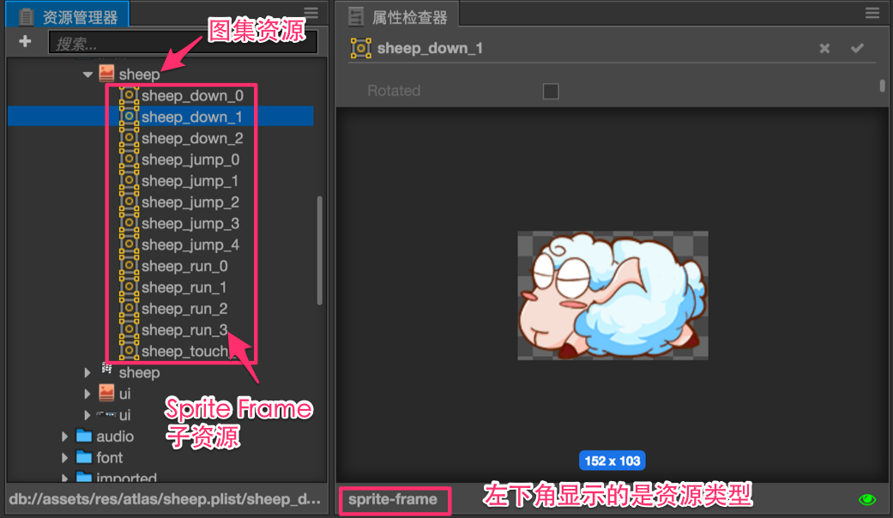

# 图集资源（Atlas）

图集（Atlas）也称作 Sprite Sheet，是游戏开发中常见的一种美术资源。图集是通过专门的工具将多张图片合并成一张大图，并通过 **plist** 等格式的文件索引的资源。可供 Cocos Creator 使用的图集资源由 **plist** 和 **png** 文件组成。下面就是一张图集使用的图片文件：

## 为什么要使用图集资源

在游戏中使用多张图片合成的图集作为美术资源，有以下优势：

- 合成图集时会去除每张图片周围的空白区域，加上可以在整体上实施各种优化算法，合成图集后可以大大减少游戏包体和内存占用
- 多个 Sprite 如果渲染的是来自同一张图集的图片时，这些 Sprite 可以使用同一个渲染批次来处理，大大减少 CPU 的运算时间，提高运行效率。

更形象生动的解释可以观看来自 CodeAndWeb 的教学视频[What is a Sprite Sheet（什么是图集）](https://www.codeandweb.com/what-is-a-sprite-sheet)。

## 制作图集资源

要生成图集，首先您应该准备好一组原始图片：

接下来可以使用专门的软件生成图集，我们推荐的图集制作软件包括：

- [TexturePacker](https://www.codeandweb.com/texturepacker)
- [Zwoptex](https://zwopple.com/zwoptex/)

使用这些软件生成图集时请选择 cocos2d-x 格式的 plist 文件。最终得到的图集文件是同名的 **plist** 和 **png**。

## 导入图集资源

将上面所示的 **plist** 和 **png** 文件同时拖拽到 **资源管理器** 中，就可以生成可以在编辑器和脚本中使用的图集资源了。

### Atlas 和 SpriteFrame

在[图像资源文档](sprite.md#texture-spriteframe-)中，我们介绍了 Texture 和 SpriteFrame 的关系。导入图集资源后，我们可以看到类型为 `Atlas` 的图集资源可以点击左边的三角图标展开，展开后可以看到图集资源里包含了很多类型为 `SpriteFrame` 的子资源，每个子资源都是可以单独使用和引用的图片。

接下来对于 Sprite Frame 的使用方法就和图像资源中介绍的一样了，请查阅相关文档。

## 碎图转图集和拆分合并图集工作流程

在项目原型阶段或生产初期，美术资源的内容和结构变化都会比较频繁，我们通常会直接使用碎图（也就是多个单独的图片）来搭建场景和制作 UI。在之后为了优化性能和节约包体，需要将碎图合并成图集，或者将图集中的内容进行拆分或合并。

目前我们提供了一个简单的小工具来完成场景中对图片资源引用从碎图或老图集到新图集的重定向。下面介绍工作流程。

1. 生成新图集：不管是从碎图合并，还是将原来的图集重新拆分或合并，您都需要先使用 TexturePacker 生成完整的新图集。然后将新图集导入到项目资源文件夹中。
2. 双击打开您需要重定向资源引用的场景或 Prefab
3. 点击主菜单的「开发者->在当前场景使用指定图集替换 spriteFrame...」，在打开的对话框里选择您新生成的图集，等待替换操作完成。（如果新图集有多张，应该重复这一步直到所有相关新图集都替换完毕）
4.如果您有多个场景或 prefab，需要重复执行 2-3 步，遍历每个相关的场景或 Prefab
5. 确认所有相关图片资源的引用都已经替换成了新图集后，现在可以删除原有的碎图或旧图集了。

继续前往 [图像资源自动剪裁](trim.md) 说明文档。