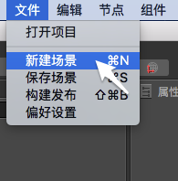
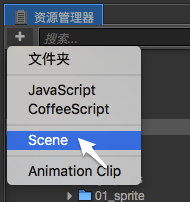
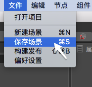

# 创建和管理场景

## 创建场景

方法一：选择主菜单：`文件/新建场景`

方法二：在 **资源管理器** 中点击创建菜单，创建新场景。

## 保存场景

方法一：使用快捷键 `Ctrl + S` (Windows) 或 `Command + S` (Mac)

方法二：选择主菜单：`文件/保存场景`

## 切换场景

在 **资源管理器** 中，双击需要打开的场景。

## 修改场景资源自动释放策略

如果项目中的场景很多，随着新场景的切换，内存占用就会不断上升。除了使用 `cc.loader.release` 等 API 来精确释放不使用的资源，我们还可以使用场景的自动释放功能。要配置自动释放，可以在 **资源管理器** 中选中所需场景，然后在 **属性检查器** 中设置“自动释放资源”选项，该项默认关闭。 
从当前场景切换到下一个场景时，如果当前场景不自动释放资源，则该场景中直接或间接引用到的所有资源（脚本动态加载的不算），**默认**都不主动释放。反之如果启用了自动释放，则这些引用到的资源**默认**都会自动释放。

### 防止特定资源被自动释放

启用了某个场景的资源自动释放后，如果在脚本中保存了该场景的资源引用，当场景切换后，这些资源就会变成非法的，很容易出错。或者如果调用 `cc.game.addPersistRootNode` 方法让某个该场景中的节点保留到了下一个场景，但这个节点及其子节点用到的所有资源也还是会被同时释放，导致下个场景不能再正确访问这些资源。为了让这部分资源在场景切换时不被释放，我们可以使用 [cc.loader.setAutoRelease](http://www.cocos.com/docs/creator/api/classes/loader.html#method_setAutoRelease) 或者 [cc.loader.setAutoReleaseRecursively](http://www.cocos.com/docs/creator/api/classes/loader.html#method_setAutoReleaseRecursively) 来保留这些资源。

## 修改场景加载策略

在 **资源管理器** 中，选中指定场景，可以在 **属性检查器** 中看到“延迟加载资源”选项，该项默认关闭。

### 不延迟加载资源

加载场景时，如果这个选项关闭，则这个场景直接或间接递归依赖的所有资源都将被加载，全部加载完成后才会触发场景切换。

### 延迟加载资源

加载场景时，如果选项开启，则这个场景直接或间接依赖的所有贴图、粒子和声音都将被延迟到场景切换后才加载，使场景切换速度极大提升。 
同时，玩家进入场景后可能会看到一些资源陆续显示出来，并且激活新界面时也可能会看到界面中的元素陆续显示出来，因此这种加载方式更适合网页游戏。 
使用这种加载方式后，为了能在场景中更快地显示需要的资源，建议一开始就让场景中暂时不需要显示的渲染组件（如 Sprite）保持非激活状态。

> Spine 和 TiledMap 依赖的资源永远都不会被延迟加载。

继续前往 [图像资源（Texture）](sprite.md) 说明文档。
