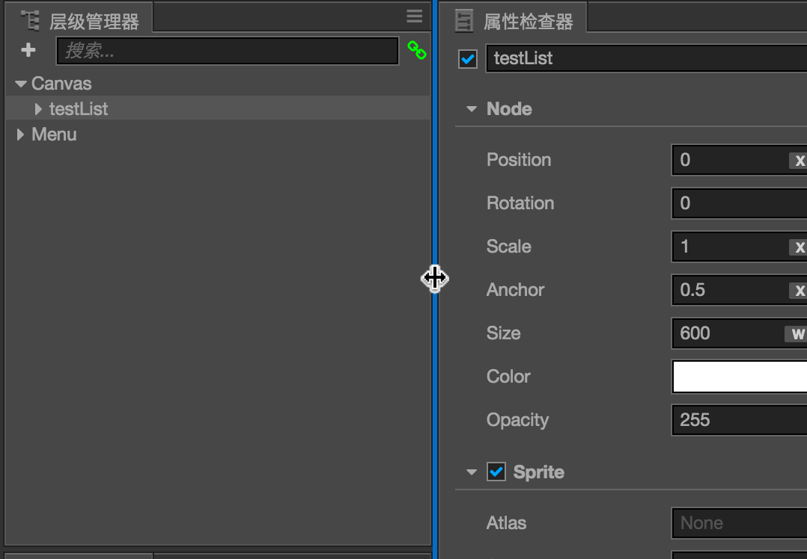
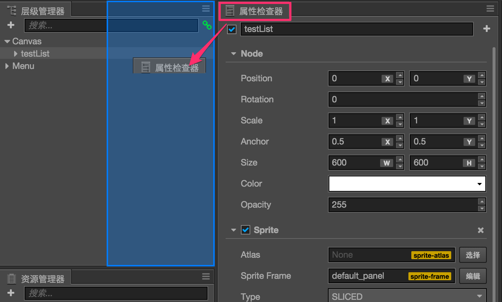
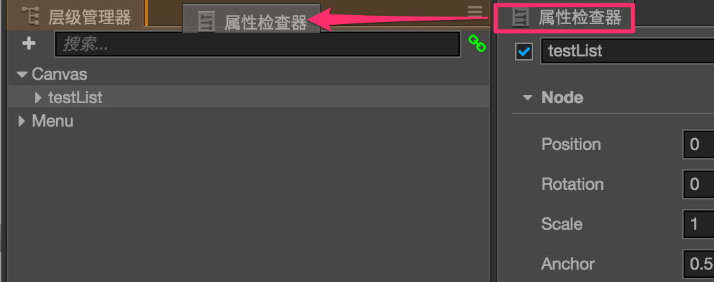
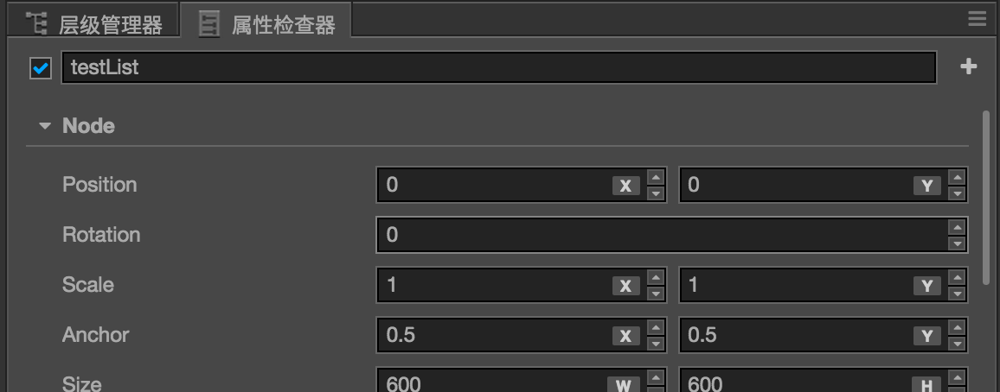

# 编辑器布局

编辑器布局是指 Cocos Creator 里各个面板的位置、大小和层叠情况。

选择主菜单里的 `布局` 菜单，可以从预设的几种编辑器面板布局中选择最适合当前项目的。在预设布局的基础上，您也可以继续对各个面板的位置和大小进行调节。对布局的修改会自动保存在项目所在文件夹下的 `local/layout.windows.json` 文件中。

## 调整面板大小

将鼠标悬浮到两个面板之间的边界线上，看到鼠标指针发生变化后，就可以按下鼠标拖动来修改相邻两个面板的大小。

部分面板设置了最小尺寸，当拖拽到最小尺寸限度后就无法再继续缩小面板了。

## 移动面板

点击面板的标签栏并拖拽，可以将面板整个移动到编辑器窗口中的任意位置。下图中红框表示可拖拽的标签栏区域，箭头表示拖拽方向：

移动面板的过程中，蓝色半透明的方框会指示松开鼠标后面板将会被放置的位置。

## 层叠面板

除了移动面板位置，拖拽标签栏的时候还可以移动鼠标到另一个面板的标签栏区域：

在目标面板的标签栏出现橙色显示时松开鼠标，就能够将两个面板层叠在一起，同时只能显示一个面板：

层叠面板在桌面分辨率不足，或排布使用率较低的面板时非常实用。层叠中的面板可以随时拖拽出来，恢复永远在最上的显示。

---

继续前往 [构建预览](preview-build.md) 说明文档。