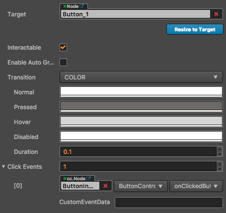

# Button（按钮）组件参考

Button 组件可以响应用户的点击操作，当用户点击 Button 时，Button 自身会有状态变化。另外，Button 还可以让用户在完成点击操作后响应一个自定义的行为。




点击**属性检查器**下面的`添加组件`按钮，然后从`添加 UI 组件`中选择`Button`，即可添加 Button 组件到节点上。

按钮的脚本接口请参考[Button API](../api/classes/Button.html)。

## Button 属性

| 属性                 | 功能说明                                                                                                                      |
| --------------       | -----------                                                                                                                   |
| Target               | Node 类型，当 Button 发生 Transition 的时候，会相应地修改 Target 节点的 SpriteFrame，颜色或者 Scale。                         |
| interactable         | 布尔类型，设为 false 时，则 Button 组件进入禁用状态。                                                                         |
| enableAutoGrayEffect | 布尔类型，当设置为 true 的时候，如果 button 的 interactable 属性为 false，则 button 的 sprite Target 会使用内置 shader 变灰。 |
| Transition           | 枚举类型，包括 NONE, COLOR，SPRITE 和 SCALE。每种类型对应不同的 Transition 设置。详情见`Button Transition`章节。              |
| Click Event          | 列表类型，默认为空，用户添加的每一个事件由节点引用，组件名称和一个响应函数组成。详情见`Button 事件`章节                       |

**注意**：当 Transition 为 SPRITE 且 disabledSprite 属性有关联一个 spriteFrame 的时候，此时不会使用内置 shader 来变灰

### Button Transition
Button 的 Transition 用来指定当用户点击 Button 时的状态表现。目前主要有 NONE，COLOR，SPRITE 和 SCALE。


### Color Transition


| 属性           | 功能说明                          |
| -------------- | -----------                       |
| Normal         | Button 在 Normal 状态下的颜色。   |
| Pressed        | Button 在 Pressed 状态下的颜色。  |
| Hover          | Button 在 Hover 状态下的颜色。    |
| Disabled       | Button 在 Disabled 状态下的颜色。 |
| Duration       | Button 状态切换需要的时间间隔。   |

### Sprite Transition


| 属性           | 功能说明                                  |
| -------------- | -----------                               |
| Normal         | Button 在 Normal 状态下的 SpriteFrame。   |
| Pressed        | Button 在 Pressed 状态下的 SpriteFrame。  |
| Hover          | Button 在 Hover 状态下的 SpriteFrame。    |
| Disabled       | Button 在 Disabled 状态下的 SpriteFrame。 |

### Scale Transition


| 属性           | 功能                                                                                                 |
| -------------- | -----------                                                                                          |
| Duration       | Button 状态切换需要的时间间隔。                                                                      |
| ZoomScale      | 当用户点击按钮后，按钮会缩放到一个值，这个值等于 Button 原始 scale * zoomScale, zoomScale 可以为负数 |

### Button 事件


| 属性            | 功能说明                                                   |
| --------------  | -----------                                                |
| Target          | 带有脚本组件的节点。                                       |
| Component       | 脚本组件名称。                                             |
| Handler         | 指定一个回调函数，当用户点击 Button 并释放时会触发此函数。 |
| CustomEventData | 用户指定任意的字符串作为事件回调的最后一个参数传入。       |

#### 详细说明

Button 目前只支持 Click 事件，即当用户点击并释放 Button 时才会触发相应的回调函数。


#### 通过脚本代码添加回调

##### 方法一

这种方法添加的事件回调和使用编辑器添加的事件回调是一样的，通过代码添加，
你需要首先构造一个 `cc.Component.EventHandler` 对象，然后设置好对应的 target, component, handler 和 customEventData 参数。

```js
//here is your component file, file name = MyComponent.js 
cc.Class({
    extends: cc.Component,
    properties: {},
    
    onLoad: function () {
        var clickEventHandler = new cc.Component.EventHandler();
        clickEventHandler.target = this.node; //这个 node 节点是你的事件处理代码组件所属的节点
        clickEventHandler.component = "MyComponent";//这个是代码文件名
        clickEventHandler.handler = "callback";
        clickEventHandler.customEventData = "foobar";

        var button = node.getComponent(cc.Button);
        button.clickEvents.push(clickEventHandler);
    },

    callback: function (event, customEventData) {
        //这里 event 是一个 Touch Event 对象，你可以通过 event.target 取到事件的发送节点
        var node = event.target;
        var button = node.getComponent(cc.Button);
        //这里的 customEventData 参数就等于你之前设置的 "foobar"
    }
});
```

##### 方法二

通过 `button.node.on('click', ...)` 的方式来添加，这是一种非常简便的方式，但是该方式有一定的局限性，在事件回调里面无法
获得当前点击按钮的屏幕坐标点。

```js
//假设我们在一个组件的 onLoad 方法里面添加事件处理回调，在 callback 函数中进行事件处理:

cc.Class({
    extends: cc.Component,

	
    properties: {
       button: cc.Button
    },
    
    onLoad: function () {
       this.button.node.on('click', this.callback, this);
    },
    
    callback: function (event) {
       //这里的 event 是一个 EventCustom 对象，你可以通过 event.detail 获取 Button 组件
       var button = event.detail;
       //do whatever you want with button
       //另外，注意这种方式注册的事件，也无法传递 customEventData
    }
});
```

---

继续前往 [ProgressBar 组件参考](progress.md) 。
