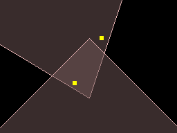

# 碰撞回调

当物体在场景中移动并碰撞到其他物体时，box2d 会处理大部分必要的碰撞检测，我们一般不需要关心这些情况。但是制作物理游戏最主要的点是有些情况下物体碰撞后应该发生些什么，比如角色碰到怪物后会死亡，或者球在地上弹动时应该产生声音等。

我们需要一个方式来获取到这些碰撞信息，物理引擎提供的方式是在碰撞发生时产生回调，在回调里我们可以根据产生碰撞的两个碰撞体的类型信息来判断需要作出什么样的动作。

**注意**

1. 需要先在 [rigidbody](rigid-body.md) 中 **开启碰撞监听**，才会有相应的回调产生。

2. 回调中的信息在物理引擎都是以缓存的形式存在的，所以信息只有在这个回调中才是有用的，不要在你的脚本里缓存这些信息，但你可以复制这些信息到你自己的缓存中来使用。

3. 在回调中创建的物理物体，比如刚体，关节等，这些不会立刻就创建出 box2d 对应的物体，会在整个物理系统更新完成后再进行这些物体的创建。

## 定义回调函数

定义一个碰撞回调函数很简单，只需要在刚体所在的节点上挂一个脚本，脚本中添加上你需要的回调函数即可。

```js
cc.Class({
    extends: cc.Component,

    // 只在两个碰撞体开始接触时被调用一次
    onBeginContact: function (contact, selfCollider, otherCollider) {
    },

    // 只在两个碰撞体结束接触时被调用一次
    onEndContact: function (contact, selfCollider, otherCollider) {
    },

    // 每次将要处理碰撞体接触逻辑时被调用
    onPreSolve: function (contact, selfCollider, otherCollider) {
    },

    // 每次处理完碰撞体接触逻辑时被调用
    onPostSolve: function (contact, selfCollider, otherCollider) {
    }
});

```

在上面的代码示例中，我们添加了所有的碰撞回调函数到这个脚本中，一共有四个类型的回调函数，每个回调函数都有三个参数。每种回调函数的作用如注释所示，你可以根据自己的需求来实现相应的回调函数。


## 回调的顺序

我们可以通过拆分一个简单的示例的碰撞过程来描述碰撞回调函数的回调顺序和回调的时机，假设有两个刚体正相互移动，三角形往右运动，方块往左运动，即将碰撞到了一起。


<table>
<tbody>
<tr>
碰撞的过程
</tr>
<tr>
<td style="padding:4px;width:256px;vertical-align:middle;border:1px solid black;text-align:center">
碰撞 1<br>
</img>
<div style="height:4px"></div>
碰撞 2<br>
</img>
<div style="height:4px"></div>
碰撞 3<br>
</img>
</td>
<td style="padding:4px;border:1px solid black">
    当两个碰撞体相互覆盖时，box2d 默认的行为是给每个碰撞体一个冲量去把他们分开，但是这个行为不一定能在一个时间步内完成。
    像这里显示的一样，示例中的碰撞体会在三个时间步内相互覆盖直到“反弹”完成并且他们相互分离。 <br>
    在这个时间里我们可以定制我们想要的行为，<b>onPreSolve</b> 会在每次处理碰撞前回调，我们
    可以在物理引擎处理碰撞前修改碰撞信息的机会，而 <b>onPostSolve</b> 会在处理完成这次碰撞后回调，我们可以在这个回调中获取到物理引擎计算出的碰撞的冲量信息。<br>
    下面给出的输出信息能使我们更清楚回调的顺序。
<pre>        ...
    Step
    Step
    BeginContact
    PreSolve
    PostSolve
    Step
    PreSolve
    PostSolve
    Step
    PreSolve
    PostSolve
    Step
    EndContact
    Step
    Step
    ...
</pre>
</td>
<tr>
</tbody>
</table>

## 回调的参数

回调的参数包含了所有的碰撞接触信息，每个回调函数都提供了三个参数 : **contact**, **selfCollider**, **otherCollider**。

**selfCollider** 和 **otherCollider** 很容易理解，如名字所示，**selfCollider** 指的是回调脚本的节点上的碰撞体，**ohterCollider** 指的是发生碰撞的另一个碰撞体。

最主要的信息都包含在 **contact** 中，这是一个 **cc.PhysicsContact** 类型的实例，可以在 api 文档中找到相关的 api 。
contact 中比较常用的信息就是碰撞的位置和法向量，contact 内部是按照刚体的本地坐标来存储信息的，而我们一般需要的是世界坐标系下的信息，我们可以通过 `contact.getWorldManifold` 来获取这些信息。

### worldManifold

```javascript
var worldManifold = contact.getWorldManifold();
var points = worldManifold.points;
var normal = worldManifold.normal;
```

`worldManifold` 具有以下成员：

#### points

碰撞点数组，他们不一定会精确的在碰撞体碰撞的地方上，如下图所示（除非你将刚体设置为子弹类型，但是会比较耗性能），但实际上这些点在使用上一般都是够用的。



**注意**：   
不是每一个碰撞都会有两个碰撞点，在模拟的更多的情况下只会产生一个碰撞点，下面列举一些其他的碰撞示例。


- normal 

碰撞点上的法向量，由自身碰撞体指向对方碰撞体，指明解决碰撞最快的方向。


在图中所示的线条即碰撞点上的法向量，在这个碰撞中，解决碰撞最快的途径是添加冲量将三角形往左上推，将方块往右下推。需要注意的是这里的法向量只是一个方向，并不带有位置属性，也不会连接到这些碰撞点中的任何一个。

你还需要明白的是**碰撞法向量并不是碰撞体碰撞的角度**，他只会指明可以解决两个碰撞体相互覆盖这一问题最短的方向。比如上面的例子中如果三角形移动得更快一点，覆盖的情形像下图所示的话：


那么最短的方式将会是把三角形往右上推，所以使用法向量来作为碰撞角度不是一个好主意。如果你希望知道碰撞的真正的方向，可以使用下面的方式：

```javascript
var vel1 = triangleBody.getLinearVelocityFromWorldPoint( worldManifold.points[0] );
var vel2 = squareBody.getLinearVelocityFromWorldPoint( worldManifold.points[0] );
var relativeVelocity = vel1.sub(vel2);
```

这个代码可以获取到两个碰撞体相互碰撞时在碰撞点上的相对速度。


### 禁用 contact

```javascript
contact.disabled = true;
```

禁用掉 contact 会使物理引擎在计算碰撞时会忽略掉这次碰撞，禁用将会持续到碰撞完成，除非在其他回调中再将这个 contact 启用。

或者如果你只想在本次物理处理步骤中禁用 contact ，可以使用 `disabledOnce`。

```javascript
contact.disabledOnce = true;
```

### 修改 contact 信息

前面有提到我们在 **onPreSolve** 中修改 contact 的信息，因为 **onPreSolve** 是在物理引擎处理碰撞信息前回调的，所以对碰撞信息的修改会影响到后面的碰撞计算。

```
// 修改碰撞体间的摩擦力
contact.setFriction(friction);

// 修改碰撞体间的弹性系数
contact.setRestitution(restitution);
```

注意这些修改只会在本次物理处理步骤中生效。
