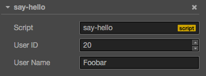

# 使用 cc.Class 声明类型

`cc.Class` 是一个很常用的 API，用于声明 Cocos Creator 中的类，为了方便区分，我们把使用 cc.Class 声明的类叫做 **CCClass**。

## 定义 CCClass

调用 `cc.Class`，传入一个原型对象，在原型对象中以键值对的形式设定所需的类型参数，就能创建出所需要的类。

```javascript
var Sprite = cc.Class({
    name: "sprite"
});
```

以上代码用 cc.Class 创建了一个类型，并且赋给了 `Sprite` 变量。同时还将类名设为 "sprite"，类名用于序列化，一般可以省略。

## 实例化

`Sprite` 变量保存的是一个 JavaScript 构造函数，可以直接 new 出一个对象：

```javascript
var obj = new Sprite();
```

## 判断类型

需要做类型判断时，可以用 JavaScript 原生的 `instanceof`：

```javascript
cc.log(obj instanceof Sprite);       // true
```

## 构造函数

使用 `ctor` 声明构造函数：

```javascript
var Sprite = cc.Class({
    ctor: function () {
        cc.log(this instanceof Sprite);    // true
    }
});
```

> Component 是特殊的 CCClass，不能定义构造函数，它的构造职能可由 `onLoad` 方法代替。

## 实例方法

```javascript
var Sprite = cc.Class({
    // 声明一个名叫 "print" 的实例方法
    print: function () { }
});
```

## 继承

使用 `extends` 实现继承：

```javascript
// 父类
var Shape = cc.Class();

// 子类
var Rect = cc.Class({
    extends: Shape
});
```

### 父构造函数

继承后，CCClass 会统一自动调用父构造函数，你不需要显式调用。

```javascript
var Shape = cc.Class({
    ctor: function () {
        cc.log("Shape");    // 实例化时，父构造函数会自动调用，
    }
});

var Rect = cc.Class({
    extends: Shape
});

var Square = cc.Class({
    extends: Rect,
    ctor: function () {
        cc.log("Square");   // 再调用子构造函数
    }
});

var square = new Square();
```

以上代码将依次输出 "Shape" 和 "Square"。

## <a name="properties"></a>声明属性

通过在组件脚本中声明属性，我们可以将脚本组件中的字段可视化地展示在 **属性检查器** 中，从而方便地在场景中调整属性值。

要声明属性，仅需要在 cc.Class 定义的 `properties` 字段中，填写属性名字和属性参数即可，如：

```javascript
cc.Class({
    extends: cc.Component,
    properties: {
        userID: 20,
        userName: "Foobar"
    }
});
```

这时候，你可以在 **属性检查器** 中看到你刚刚定义的两个属性：



在 Cocos Creator 中，我们提供两种形式的属性声明方法：

### 简单声明

在多数情况下，我们都可以使用简单声明。

- 当声明的属性为基本 JavaScript 类型时，可以直接赋予默认值：
     
    ```javascript
    properties: {
        height: 20,       // number
        type: "actor",    // string
        loaded: false,    // boolean                
        target: null,     // object
    }
    ```

- 当声明的属性具备类型时（如：`cc.Node`，`cc.Vec2` 等），可以在声明处填写他们的构造函数来完成声明，如：

    ```javascript
    properties: {
        target: cc.Node,
        pos: cc.Vec2,
    }
    ```

- 当声明属性的类型继承自 `cc.ValueType` 时（如：`cc.Vec2`，`cc.Color` 或 `cc.Rect`），除了上面的构造函数，还可以直接使用实例作为默认值：

    ```javascript
    properties: {
        pos: new cc.Vec2(10, 20),
        color: new cc.Color(255, 255, 255, 128),
    }
    ```

- 当声明属性是一个数组时，可以在声明处填写他们的类型或构造函数来完成声明，如：
                
    ```javascript
    properties: {
        any: [],      // 不定义具体类型的数组
        bools: [cc.Boolean],
        strings: [cc.String],
        floats: [cc.Float],
        ints: [cc.Integer],
        
        values: [cc.Vec2],
        nodes: [cc.Node],
        frames: [cc.SpriteFrame],
    }
    ```

**注意**：除了以上几种情况，其他类型我们都需要使用**完整声明**的方式来进行书写。

### 完整声明

有些情况下，我们需要为属性声明添加参数，这些参数控制了属性在 **属性检查器** 中的显示方式，以及属性在场景序列化过程中的行为。例如：

```javascript
properties: {
    score: {
        default: 0,
        displayName: "Score (player)",
        tooltip: "The score of player",
    }
}
```

以上代码为 `score` 属性设置了三个参数 `default`, `displayName` 和 `tooltip`。这几个参数分别指定了 `score` 的默认值为 0，在 **属性检查器** 里，其属性名将显示为：“Score (player)”，并且当鼠标移到参数上时，显示对应的 Tooltip。

下面是常用参数：

- **default**: 设置属性的默认值，这个默认值仅在组件**第一次**添加到节点上时才会用到
- **type**: 限定属性的数据类型，详见 [CCClass 进阶参考：type 参数](reference/class.md#type)
- **visible**: 设为 false 则不在 **属性检查器** 面板中显示该属性
- **serializable**: 设为 false 则不序列化（保存）该属性
- **displayName**: 在 **属性检查器** 面板中显示成指定名字
- **tooltip**: 在 **属性检查器** 面板中添加属性的 Tooltip

更多的属性参数，可阅读 [属性参数](reference/attributes.md)

#### 数组声明

数组的 default 必须设置为 `[]`，如果要在 **属性检查器** 中编辑，还需要设置 type 为构造函数，枚举，或者 `cc.Integer`，`cc.Float`，`cc.Boolean` 和 `cc.String`。

```javascript
properties: {
    names: {
        default: [],
        type: [cc.String]   // 用 type 指定数组的每个元素都是字符串类型
    },

    enemies: {
        default: [],
        type: [cc.Node]     // type 同样写成数组，提高代码可读性
    },
}
```

### get/set 声明

在属性中设置了 get 或 set 以后，访问属性的时候，就能触发预定义的 get 或 set 方法。定义方法如下：

```javascript
properties: {
    width: {
        get: function () {
            return this._width;
        },
        set: function (value) {
            this._width = value;
        }
    }
}
```

> 如果你只定义 get 方法，那相当于属性只读。<br>

---

继续前往 [访问节点和其他组件](access-node-component.md) 或 [CCClass 进阶参考](reference/class.md)。
