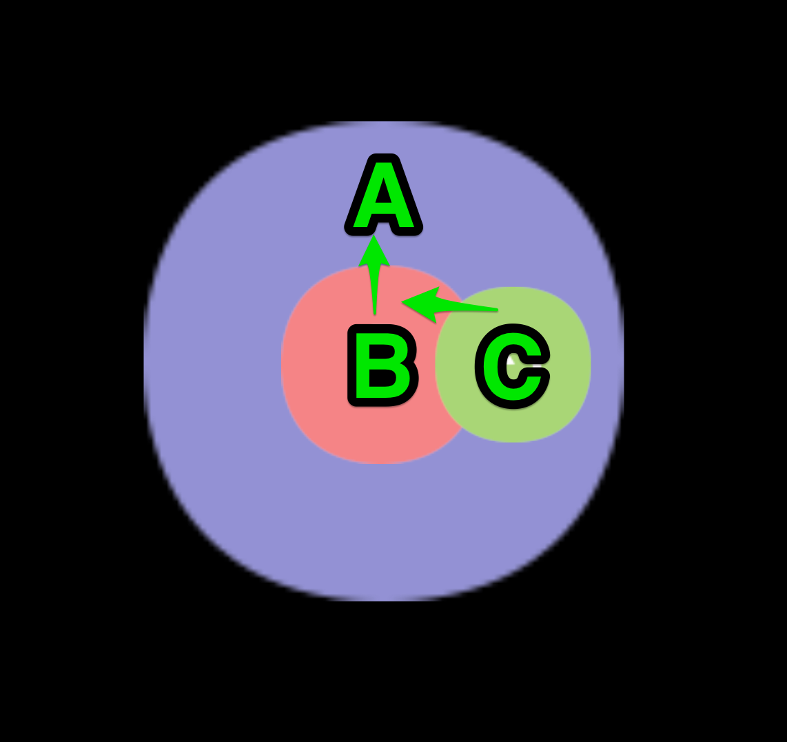

# 系统内置事件

如上一篇文档所述，`cc.Node` 有一套完整的[事件监听和分发机制](./events.md)。在这套机制之上，我们提供了一些基础的系统事件，这篇文档将介绍这些事件的使用方式。

系统事件遵守通用的注册方式，开发者既可以使用枚举类型也可以直接使用事件名来注册事件的监听器，事件名的定义遵循 DOM 事件标准。

```
// 使用枚举类型来注册
node.on(cc.Node.EventType.MOUSE_DOWN, function (event) {
  console.log('Mouse down');
}, this);
// 使用事件名来注册
node.on('mousedown', function (event) {
  console.log('Mouse down');
}, this);
``` 

## 鼠标事件类型和事件对象

鼠标事件在桌面平台才会触发，系统提供的事件类型如下：

| 枚举对象定义 | 对应的事件名 | 事件触发的时机 |
| ---------- |:----------:|:-----------:|
| `cc.Node.EventType.MOUSE_DOWN` | 'mousedown' | 当鼠标在目标节点区域按下时触发一次 |
| `cc.Node.EventType.MOUSE_ENTER` | 'mouseenter' | 当鼠标移入目标节点区域时，不论是否按下 |
| `cc.Node.EventType.MOUSE_MOVE` | 'mousemove' | 当鼠标在目标节点在目标节点区域中移动时，不论是否按下 |
| `cc.Node.EventType.MOUSE_LEAVE` | 'mouseleave' | 当鼠标移出目标节点区域时，不论是否按下 |
| `cc.Node.EventType.MOUSE_UP` | 'mouseup' | 当鼠标从按下状态松开时触发一次 |
| `cc.Node.EventType.MOUSE_WHEEL` | 'mousewheel' | 当鼠标滚轮滚动时 |

鼠标事件（`cc.Event.EventMouse`）的重要 API 如下（`cc.Event` 标准事件 API 之外）：

| 函数名 | 返回值类型 | 意义 |
| ------ |:-------:|:----:|
| `getScrollY` | `Number` | 获取滚轮滚动的 Y 轴距离，只有滚动时才有效 |
| `getLocation` | `Object` | 获取鼠标位置对象，对象包含 x 和 y 属性 |
| `getLocationX` | `Number` | 获取鼠标的 X 轴位置 |
| `getLocationY` | `Number` | 获取鼠标的 Y 轴位置 |
| `getPreviousLocation` | `Object` | 获取鼠标事件上次触发时的位置对象，对象包含 x 和 y 属性 |
| `getDelta` | `Object` | 获取鼠标距离上一次事件移动的距离对象，对象包含 x 和 y 属性 |
| `getButton` | `Number` | `cc.Event.EventMouse.BUTTON_LEFT` 或 `cc.Event.EventMouse.BUTTON_RIGHT` 或 `cc.Event.EventMouse.BUTTON_MIDDLE` |

## 触摸事件类型和事件对象

触摸事件在移动平台和桌面平台都会触发，这样做的目的是为了更好得服务开发者在桌面平台调试，只需要监听触摸事件即可同时响应移动平台的触摸事件和桌面端的鼠标事件。系统提供的触摸事件类型如下：

| 枚举对象定义 | 对应的事件名 | 事件触发的时机 |
| ---------- |:----------:|:-----------:|
| `cc.Node.EventType.TOUCH_START` | 'touchstart' | 当手指触点落在目标节点区域内时 |
| `cc.Node.EventType.TOUCH_MOVE` | 'touchmove' | 当手指在屏幕上目标节点区域内移动时 |
| `cc.Node.EventType.TOUCH_END` | 'touchend' | 当手指在目标节点区域内离开屏幕时 |
| `cc.Node.EventType.TOUCH_CANCEL` | 'touchcancel' | 当手指在目标节点区域外离开屏幕时 |

触摸事件（`cc.Event.EventTouch`）的重要 API 如下（`cc.Event` 标准事件 API 之外）：

| API 名 | 类型 | 意义 |
| ------ |:---:|:----:|
| `touch` | `cc.Touch` | 与当前事件关联的触点对象 |
| `getID` | `Number` | 获取触点的 ID，用于多点触摸的逻辑判断 |
| `getLocation` | `Object` | 获取触点位置对象，对象包含 x 和 y 属性 |
| `getLocationX` | `Number` | 获取触点的 X 轴位置 |
| `getLocationY` | `Number` | 获取触点的 Y 轴位置 |
| `getPreviousLocation` | `Object` | 获取触点上一次触发事件时的位置对象，对象包含 x 和 y 属性 |
| `getStartLocation` | `Object` | 获取触点初始时的位置对象，对象包含 x 和 y 属性 |
| `getDelta` | `Object` | 获取触点距离上一次事件移动的距离对象，对象包含 x 和 y 属性 |

需要注意的是，触摸事件支持多点触摸，每个触点都会发送一次事件给事件监听器。

## 触摸事件冒泡

触摸事件支持节点树的事件冒泡，以下图为例：



在图中的场景里，A节点拥有一个子节点B，B拥有一个子节点C。假设开发者对A、B、C都监听了触摸事件。当鼠标或手指在B节点区域内按下时，事件将首先在B节点触发，B节点监听器接收到事件。接着B节点会将事件向其父节点传递这个事件，A节点的监听器将会接收到事件。这就是最基本的事件冒泡过程。

当鼠标或手指在C节点区域内按下时，事件将首先在C节点触发并通知C节点上注册的事件监听器。C节点会通知B节点这个事件，B节点内逻辑会负责检查触点是否发生在自身区域内，如果是则通知自己的监听器，否则什么都不做。紧接着A节点会收到事件，由于C节点完整处在A节点中，所以注册在A节点上的事件监听器都将收到触摸按下事件。以上的过程解释了事件冒泡的过程和根据节点区域来判断是否分发事件的逻辑。

除了根据节点区域来判断是否分发事件外，触摸事件的冒泡过程与普通事件的冒泡过程并没有区别。所以，调用 `event` 的 `stopPropagation` 函数可以主动停止冒泡过程。

## `cc.Node` 的其它事件

| 枚举对象定义 | 对应的事件名 | 事件触发的时机 |
| ---------- |:----------:|:-----------:|
| 无 | 'position-changed' | 当位置属性修改时 |
| 无 | 'rotation-changed' | 当旋转属性修改时 |
| 无 | 'scale-changed' | 当缩放属性修改时 |
| 无 | 'size-changed' | 当宽高属性修改时 |
| 无 | 'anchor-changed' | 当锚点属性修改时 |