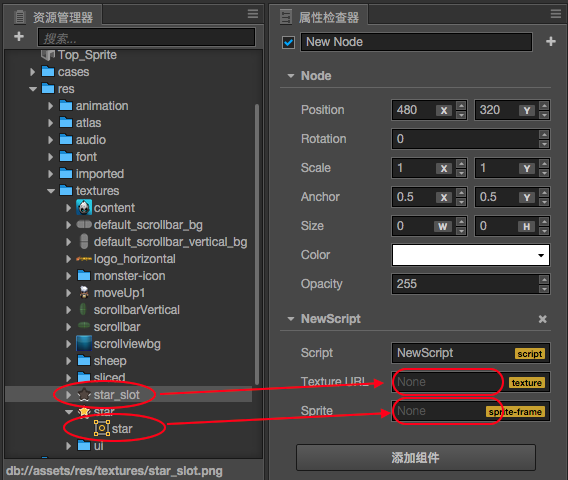
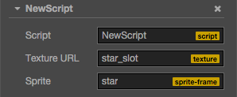
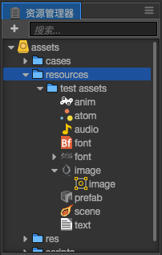

# 获取和加载资源

Cocos Creator 有一套统一的资源管理机制 ，在本篇教程，我们将介绍

- 资源的分类
- 如何在 **属性检查器** 里设置资源
- 动态加载 Asset
- 动态加载 Raw Asset

## 资源的分类

目前的资源分成两种，一种叫做 **Asset**，一种叫做 **Raw Asset**。

### Asset

Creator 提供了名为 "Asset" 的资源类型，`cc.SpriteFrame`, `cc.AnimationClip`, `cc.Prefab` 等资源都属于 Asset。Asset 的加载是统一并且自动化的，相互依赖的 Asset 能够被自动预加载。

> 例如，当引擎在加载场景时，会先自动加载场景关联到的资源，这些资源如果再关联其它资源，其它也会被先被加载，等加载全部完成后，场景加载才会结束。

因此只要你拿到了一个 Asset 对象，这个对象一定是已经加载结束的，可以直接通过对象上的属性访问到资源的所有数据。当你要在引擎中使用这些资源，引擎的 API 接收的都必须是一个加载好的 Asset 对象。

脚本中可以这样定义一个 Asset 属性：

```javascript
// NewScript.js

cc.Class({
    extends: cc.Component,
    properties: {

        spriteFrame: {
            default: null,
            type: cc.SpriteFrame
        },

    }
});
```

### Raw Asset

为了兼容 Cocos2d 的一些既有 API，我们把保留原始资源文件扩展名资源叫做 "Raw Asset"。图片（`cc.Texture2D`），声音（`cc.AudioClip`），粒子（`cc.ParticleAsset`）等资源都是 Raw Asset。Raw Asset 在脚本里由一个 url 字符串来表示，当你要在引擎中使用 Raw Asset，只要把 url 传给引擎的 API，引擎内部会自动加载这个 url 对应的资源。

当你在脚本里声明一个类型是 `cc.Texture2D` 的 Raw Asset，一开始可能会想这样定义：

```javascript
cc.Class({
    extends: cc.Component,
    properties: {

        textureURL: {
            default: null,
            type: cc.Texture2D
        }

    }
});
```

这样写的问题在于，在代码中 `textureURL` 实际上是一个字符串，而不是 `cc.Texture2D` 的实例。为了不混淆 type 的语义，在 CCClass 中声明 Raw Asset 的属性时，要用 `url: cc.Texture2D` 而不是 `type: cc.Texture2D`。

```javascript
cc.Class({
    extends: cc.Component,
    properties: {

        textureURL: {
            default: "",
            url: cc.Texture2D
        }

    }
});
```

## 如何在属性检查器里设置资源

不论是 Asset 还是 Raw Asset，只要在脚本中定义好类型，就能直接在 **属性检查器** 很方便地设置资源。假设我们有这样一个组件：

```javascript
// NewScript.js

cc.Class({
    extends: cc.Component,
    properties: {

        textureURL: {
            default: "",
            url: cc.Texture2D
        },
        spriteFrame: {
            default: null,
            type: cc.SpriteFrame
        },

    }
});
```

将它添加到场景后，**属性检查器** 里是这样的：


接下来我们从 **资源管理器** 里面分别将一张贴图和一个 SpriteFrame 拖到 **属性检查器** 的对应属性中：



结果如下：



这样就能在脚本里直接拿到设置好的资源：

```javascript
    onLoad: function () {
        var spriteFrame = this.spriteFrame;
        var textureURL = this.textureURL;

        spriteFrame.setTexture(textureURL);
    }
```

在 **属性检查器** 里设置资源虽然很直观，但资源只能在场景里预先设好，没办法动态切换。如果需要动态切换，你需要看看下面的内容。

## 动态加载

所有需要通过脚本动态加载的资源，都必须放置在 `resources` 文件夹或它的子文件夹下。`resources` 需要在 assets 文件夹中手工创建，并且必须位于 assets 的根目录，就像这样：



这里的 `image/image`, `prefab`, `anim`, `font` 都是常见的 Asset，而 image, audio 则是常见的 Raw Asset。

> `resources` 文件夹里面的资源，可以关联依赖到文件夹外部的其它资源，同样也可以被外部场景或资源引用到。项目构建时，除了已在 **构建发布** 面板勾选的场景外，`resources` 文件夹里面的所有资源，连同它们关联依赖的 `resources` 文件夹外部的资源，都会被导出。所以如果一份资源不需要由脚本**直接**动态加载，那么不用放在 `resources` 文件夹里。

### 动态加载 Asset

Creator 提供了 `cc.loader.loadRes` 这个 API 来专门加载那些位于 resources 目录下的 Asset。和 `cc.loader.load` 不同的是，loadRes 一次只能加载单个 Asset。调用时，你只要传入相对 resources 的路径即可，并且路径的结尾处**不能**包含文件扩展名。

```javascript
// 加载 Prefab
cc.loader.loadRes("test assets/prefab", function (err, prefab) {
    var newNode = cc.instantiate(prefab);
    cc.director.getScene().addChild(newNode);
});

// 加载 AnimationClip
var self = this;
cc.loader.loadRes("test assets/anim", function (err, clip) {
    self.node.getComponent(cc.Animation).addClip(clip, "anim");
});

// 加载 SpriteAtlas（图集），并且获取其中的一个 SpriteFrame
// 注意 atlas 资源文件（plist）通常会和一个同名的图片文件（png）放在一个目录下, 所以需要在第二个参数指定资源类型
cc.loader.loadRes("test assets/sheep", cc.SpriteAtlas, function (err, atlas) {
    var frame = atlas.getSpriteFrame('sheep_down_0');
    sprite.spriteFrame = frame;
});
```

#### 加载独立的 SpriteFrame

图片设置为 Sprite 后，将会在 **资源管理器** 中生成一个对应的 SpriteFrame。但如果直接加载 `test assets/image`，得到的类型将会是 cc.Texture2D。你必须指定第二个参数为资源的类型，才能加载到图片生成的 cc.SpriteFrame：

```javascript
// 加载 SpriteFrame
var self = this;
cc.loader.loadRes("test assets/image", cc.SpriteFrame, function (err, spriteFrame) {
    self.node.getComponent(cc.Sprite).spriteFrame = spriteFrame;
});
```

> 如果指定了类型参数，就会在路径下查找指定类型的资源。当你在同一个路径下同时包含了多个重名资源（例如同时包含 player.clip 和 player.psd），或者需要获取“子资源”（例如获取 Texture2D 生成的 SpriteFrame），就需要声明类型。

#### 资源释放

`loadRes` 加载进来的单个资源如果需要释放，可以调用 `cc.loader.releaseRes`，`releaseRes` 可以传入和 `loadRes` 相同的路径和类型参数。

```javascript
cc.loader.releaseRes("test assets/image", cc.SpriteFrame);
cc.loader.releaseRes("test assets/anim");
```

此外，你也可以使用 `cc.loader.releaseAsset` 来释放一个具体的 Asset 实例。

```javascript
cc.loader.releaseAsset(spriteFrame);
```

### 动态加载 Raw Asset

Raw Asset 可以直接使用 url 从远程服务器上加载，也可以从项目中动态加载。对远程加载而言，原先 Cocos2d 的加载方式不变，使用 cc.loader.load 即可。对项目里的 Raw Asset，加载方式和 Asset 一样：

```javascript
// 加载 Texture，不需要后缀名
cc.loader.loadRes("test assets/image", function (err, texture) {
    ...
});
```

#### cc.url.raw

Raw Asset 加载成功后，如果需要传给一些 url 形式的 API，还是需要给出完整路径才行。你需要用 `cc.url.raw` 进行一次 url 的转换：

```javascript
// 原 url 会报错！文件找不到
var texture = cc.textureCache.addImage("resources/test assets/image.png");

// 用 cc.url.raw，此时需要声明 resources 目录和文件后缀名
var realUrl = cc.url.raw("resources/test assets/image.png");
var texture = cc.textureCache.addImage(realUrl);
```

### 资源批量加载

`cc.loader.loadResDir` 可以加载相同路径下的多个资源：

```javascript
// 加载 test assets 目录下所有资源
cc.loader.loadResDir("test assets", function (err, assets) {
    // ...
});

// 加载 sheep.plist 图集中的所有 SpriteFrame
cc.loader.loadResDir("test assets/sheep", cc.SpriteFrame, function (err, assets) {
    // assets 是一个 SpriteFrame 数组，已经包含了图集中的所有 SpriteFrame。
    // 而 loadRes('test assets/sheep', cc.SpriteAtlas, function (err, atlas) {...}) 获得的则是整个 SpriteAtlas 对象。
});
```
