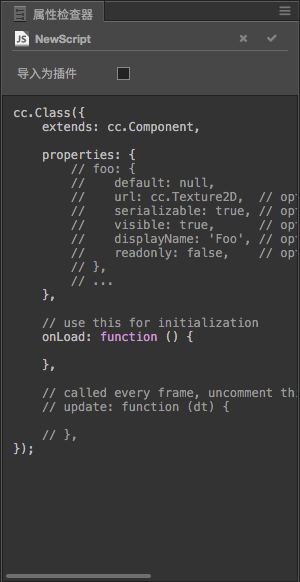

# 插件脚本



在 **资源管理器** 中选中任意一个脚本，就能在 **属性检查器** 中看到这样一个设置界面，我们可以在这里设置脚本是否“导入为插件”。导入为插件是一个不太常用到的选项，初学者简单了解即可。

 - 对组件脚本，数据逻辑而言，一般默认都取消这个选项，这样的脚本简称**普通脚本**。
 - 对第三方插件，或者底层插件，就有可能需要选中选项，这样的脚本简称**插件脚本**。

这个选项只和脚本有关，具体影响有几个方面：

类型： | 普通脚本 | 插件脚本
---------- | ----------- | -----------
声明组件 | 支持 | 不支持
[模块化](../scripting/modular-script.md) | 支持，可以通过 [require](../scripting/modular-script.md#require) 引用其它普通脚本，不能 require 插件脚本 | 不提供，也不能 require 普通脚本
变量作用域 | 每个脚本内定义的局部变量不会暴露到全局 | 运行时，脚本内不在任何函数内的局部变量都会暴露成全局变量
use strict | 强制开启，未定义的变量不能赋值 | 需要手动声明，否则未定义的变量一旦赋值就会变成全局变量
脚本导入编辑器时 | 脚本中的 ES2015 特性会先[转译](../scripting/reference/javascript-support.md)，再进入统一的模块化解析 | 不做任何处理
项目构建阶段时 | 所有普通脚本都会打包成**单个**脚本文件，非“调试模式”下还会压缩 | 不进行打包，非“调试模式”下会被压缩
SourceMap | 支持 | 不支持

## 脚本加载顺序

脚本加载顺序如下：

 1. Cocos2d 引擎
 1. 插件脚本（有多个的话按项目中的路径字母顺序依次加载）
 1. 普通脚本（打包后只有一个文件，内部按 require 的依赖顺序依次初始化）

## 目标平台兼容性

插件发布后将直接被目标平台加载，所以请检查插件的目标平台兼容性，否则项目发布后插件有可能不能运行。

 - **目标平台不提供原生 node.js 支持**<br>例如很多 [npm](https://www.npmjs.com/) 模块都直接或间接依赖于 node.js，这样的话发布到原生或网页平台后是不能用的。
 - **依赖 DOM API 的插件将无法发布到原生平台**<br>网页中可以使用大量的前端插件，例如 jQuery，不过它们有可能依赖于浏览器的 DOM API。依赖这些 API 的插件不能用于原生平台中。

## 注意事项

 - **如果插件包含了多个脚本，则需要把插件用到的所有脚本合并为单个的 js 文件**<br>
 以 Async（[https://github.com/caolan/async](https://github.com/caolan/async)）为例，这个库包含了非常多的零散的源文件，如果把所有源文件都放到项目里，则每个源文件都要设置一次“导入为插件”，并且 Creator 无法保证这些源文件之间的加载顺序，很容易报错。所以我们要找到插件作者提供的预编译好的单个脚本，例如 async.js 或 async.min.js，这样的文件可以直接用浏览器加载运行，不需要做额外的编译操作，一般可以直接放入 Creator 中使用。如果插件作者没提供打包好的版本，通常也会在文档中说明如何编译出浏览器可执行的脚本，照着操作就行。

 - **如果插件还依赖于其它插件，也需要把多个插件合并为单个 js 文件**<br>
 以 [protobuf.js](https://github.com/dcodeIO/ProtoBuf.js) 为例，这个库还依赖于 [bytebuffer.js](https://github.com/dcodeIO/bytebuffer.js)，但是插件作者并没有提供整合好的独立运行版本。我们可以先下载到这两个库各自编译后的两个文件 [protobuf.js](https://github.com/dcodeIO/protobuf.js/tree/master/dist/) 和 [bytebuffer.js](https://github.com/dcodeIO/bytebuffer.js/tree/master/dist)，然后使用文本编辑器或类似 `cat` 这样的命令行工具将这两个脚本拼合成一个新的脚本 protobuf_all.js。然后就能在 Creator 中直接使用这个 protobuf_all.js 了。

- **不支持插件主动加载其它脚本**<br>
以 [lzma 插件](https://github.com/nmrugg/LZMA-JS)为例，这个插件默认提供的 `lzma.js` 脚本会通过浏览器的 Worker 加载另一个工作者脚本，目前 Creator 不支持这样的额外加载。解决方式是[单独使用 `lzma_worker.js` 就好](https://github.com/nmrugg/LZMA-JS#but-i-dont-want-to-use-web-workers)。其它像是内部采用 `document.createElement("script")` 自行加载依赖项的插件，也需要做类似处理才能导入 Creator。

## 全局变量

由于所有插件脚本都保证了会在普通脚本之前加载，那么除了用来加载插件，你还可以利用这个特性声明一些特殊的全局变量。你可以在项目中添加这样一个脚本，并且设置“导入为插件”：

```javascript
/* globals.js */

// 定义新建组件的默认值
window.DEFAULT_IP = "192.168.1.1";

// 定义组件开关
window.ENABLE_NET_DEBUGGER = true;

// 定义引擎 API 缩写（仅适用于构造函数）
window.V2 = cc.Vec2;
```

接下来你就能在任意的**普通**脚本中直接访问它们：

```javascript
/* network.js */

cc.Class({
    extends: cc.Component,
    properties: {
        ip: {
            default: DEFAULT_IP
        }
    }
});
```

```javascript
/* network_debugger.js */

if (ENABLE_NET_DEBUGGER) {
    // ENABLE_NET_DEBUGGER 时这个组件才生效
    cc.Class({
        extends: cc.Component,
        properties: {
            location: {
                default: new V2(100, 200)
            }
        },
        update: function () {
            ...
        },
    });
}
else {
    // 否则这个组件什么也不做
    cc.Class({
        extends: cc.Component,
        start: function () {
            // 在开始后就移除该组件
            this.destroy();
        }
    });
}
```

在这个案例中，由于 `network.js` 和 `network_debugger.js` 等脚本加载时就已经用到了 `globals.js` 的变量。如果 `globals.js` 不是插件脚本，则每个可能用到那些全局变量的脚本都要在最上面声明 `require("globals");`，才能保证 `globals.js` 先加载。

但假如一个全局变量本身就是要在组件 onLoad 时才能初始化，那么建议直接在普通脚本的 onLoad 里直接使用 `window.foo = bar` 来声明全局变量，不需要使用插件脚本，详见[通过全局变量访问](../scripting/access-node-component.md#global_variable)。

请注意：游戏脱离编辑器运行时，插件脚本将直接运行在全局作用域，脚本内不在任何函数内的局部变量都会暴露成全局变量，请小心因此引发的全局变量污染。

> - 你应当很谨慎地使用全局变量，当你要用全局变量时，应该很清楚自己在做什么，我们并不推荐滥用全局变量，即使要用也最好保证全局变量只读。
> - 添加全局变量时，请小心不要和系统已有的全局变量重名。
> - 你需要小心确保全局变量使用之前都已初始化和赋值。
> - 你可以在插件脚本中自由封装或者扩展 Cocos2d 引擎，但这会提高团队沟通成本，导致脚本难以复用。


<hr>
返回 [脚本开发工作流程](index.md)。
