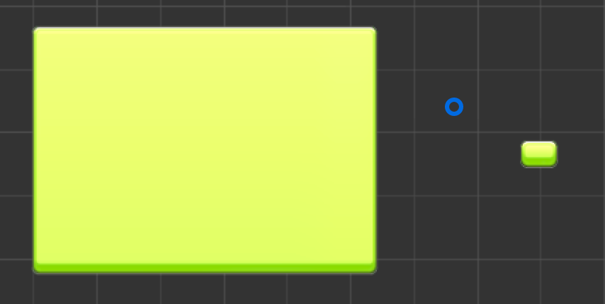
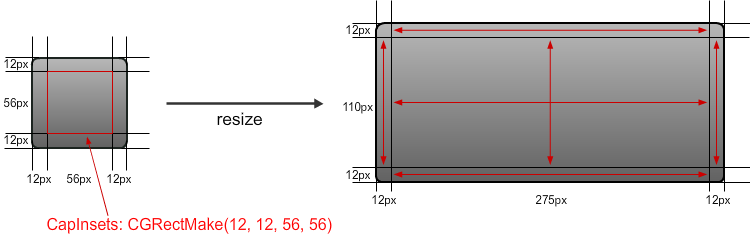

# 使用 Sliced Sprite 制作 UI 图像

在开发 UI 界面时，我们通常会使用九宫格格式的图像来显示尺寸可能会根据适配屏幕分辨率的需要动态修改的 UI 元素。这样即使使用很小的原始图片也能生成覆盖整个屏幕的背景图像，一方面节约游戏包体空间，另一方面能够灵活适配不同的排版需要。

上图右边为原始贴图大小的显示，左边是选择 Sliced 模式并放大 `size` 属性后的显示效果。

## 编辑图像资源的九宫格切分

要使用可以无限放大的九宫格图像效果，我们需要先对图像资源进行九宫格切分。有两种方式可以打开 **Sprite 编辑器**来编辑图像资源：

- 在**资源管理器**中选中图像资源，然后点击**属性检查器**最下面的**编辑**按钮。如果您的窗口高度不够，可能需要向下滚动**属性检查器**才能看到下面的按钮。
- 在**场景编辑器**中选中想要九宫格化的图像节点，然后在**属性检查器**的 Sprite 组件里，找到并按下`Sprite Frame`属性右侧的**编辑**按钮。

打开**Sprite 编辑器**以后，可以看到图像周围有一圈绿色的线条，表示当前九宫格分割线的位置。将鼠标移动到分割线上，可以看到光标形状改变了，这时候就可以按下并拖拽鼠标来更改分割线的位置。

我们分别拖动上下左右四条分割线，将图像切分成九宫格，九个区域在 Sprite 尺寸（`size`）变化时会应用不同的缩放策略，见下图：

而下图中描述了不同区域缩放时的示意（图片来自[Yannick Loriot的博客](http://yannickloriot.com/2011/12/create-buttons-in-cocos2d-by-using-cccontrolbutton/)）：

完成切分后别忘记点击**Sprite 编辑器**右上角的绿色对勾来保存对资源的修改。

## 设置 Sprite 组件使用 Sliced 模式

准备好九宫格切分的资源后，就可以修改 Sprite 的显示模式并通过修改`size`来制作可任意指定尺寸的 UI 元素了。

1. 首先选中场景中的 Sprite 节点，将 Sprite 的`Type`属性设为`Sliced`。
2. 然后通过[矩形变换工具](../basics/editor-panels/scene.html#--12)拖拽控制点使节点的`size`属性变大。您也可以直接在**属性检查器**中输入数值来修改`size`属性。如果图像资源是用九宫格的形式生产的，那么不管 Sprite 如何放大，都不会产生模糊或变形。

## 注意事项

在使用**矩形变换工具**或直接修改 Sliced Sprite 的`size`属性时，注意`size`属性值不能为负数，否则不能以 Sliced 模式正常显示。

---

我们现在掌握了生产可以任意指定尺寸的图像的方法，接下来请继续前往 [多分辨率适配和元素对齐设置](multi-resolution.md) 说明文档来学习如何利用可变尺寸的图像实现多分辨率适配和各种对齐排版效果。

