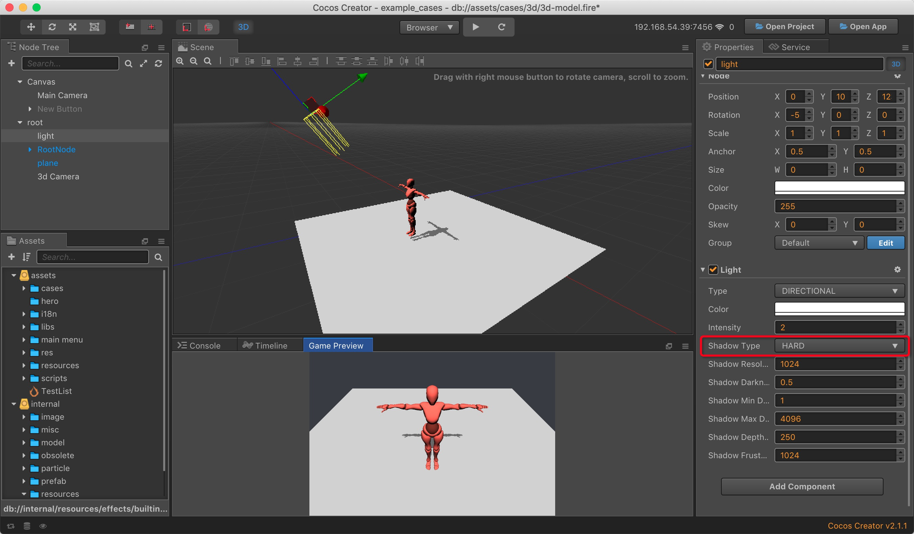

# 光照

在场景中添加光源能使 3D 场景产生相应的阴影和光照效果，光照的强弱和范围能烘托出场景的范围，场景可以渲染的更加真实。

## 添加光源

你可以通过 **节点->创建灯光** 来添加一个包含 **灯光组件** 的节点到场景中，也可以在 **属性编辑器** 中点击 **添加组件->渲染组件->Light** 来添加 **灯光组件** 到节点上。

## 光源类型

### 平行光

平行光是最常见的一中灯光，他的照射跟太阳光近似，不受位置和缩放影响（可以从下图看到，平面产生的亮度都一样），但是旋转会影响到平行光光线照射的方向，而光照方向又会影响到模型接受光照的范围以及模型产生阴影的位置。

你可以通过修改 **Color** 来调整灯光颜色，修改 **Indensity** 来调整光照强度。

### 点光源

点光源从一个点向四周发散光线，接近于蜡烛产生的光线。在编辑器中可以看到的光源位置和他的照射范围。

你可以通过修改 **Range** 来修改点光源的光照范围。

### 聚光灯

聚光灯是由一个点向一个方向发射一束光线，接近于手电筒产生的光线，

聚光灯比其他的光源又多了 **Spot Angle** 属性，通过他可以调整聚光灯的光照范围。

## 设置阴影

要使物体能够产生阴影，需要几个步骤：

1. 更改 **灯光组件** 上的 **Shadow Type** 选项，**NONE** 表示灯光不会生成生成阴影，**HARD** 表示灯光会生成硬阴影。
2. 选择要生成阴影的 **MeshRenderer 组件**，更改 **Shadow Casting Mode** 选项，**OFF** 表示不会生成阴影，**ON** 表示会生成阴影
3. 选择要接受阴影的 **MeshRenderer 组件**，更改 **Receive Shadows** 选项，**True** 表示会接受阴影，反之则不会接受阴影。

假设我们希望在一个平面上显示一个模型的投影，那么各节点的选项可以参考下图所示：

1. 灯光组件

2. 模型的 MeshRenderer 组件

3. 平面的 MeshRenderer 组件

