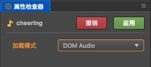

# 声音资源

声音资源就是简单的音频文件。

引擎通过各个平台提供的基础接口，播放不同的声音资源来实现游戏内的背景音乐和音效。

## 关于声音的加载模式

**音频的加载方式只影响 Web 平台上的加载效果** <br>
由于各个 Web 平台实现标准的进度不一致，所以提供了两种声音资源的加载方式。

### Web Audio


通过 Web Audio 方式加载的声音资源，在引擎内是以一个 buffer 的形式缓存的。

这种方式的优点是兼容性好，问题比较少。缺点是占用的内存资源过多。

### DOM Audio



通过生成一个标准的 audio 元素来播放声音资源，缓存的就是这个 audio 元素。

使用标准的 audio 元素播放声音资源的时候，在某些浏览器上可能会遇到一些限制。比如：每次播放必须是用户操作事件内才允许播放（Web Audio 只要求第一次），且只允许播放一个声音资源等。

如果是比较大的音频如背景音乐，建议使用 DOM Audio

## 手动选择按某种解析方式加载音频

有时候我们可能不会使用场景的自动加载或是预加载功能，而是希望自己手动控制 cc.load 资源的加载流程。
这个时候我们也是可以通过音频资源的 url 来选择加载的方式。

### 默认方式加载音频

音频默认是使用 Web Audio 的方式加载并播放的，只有在不支持的浏览器才会使用 dom 元素加载播放。

```js
cc.loader.load(cc.url.raw('resources/background.mp3'), callback);
```

### 强制使用 dom element 加载

1. 在资源管理器内选中一个 audio，属性检查器内会有加载模式的选择

2. 音频在加载过程中，会读取 url 内的 get 参数。其中只需要定义一个 useDom 参数，使其有一个非空的值，这样在 audioDownloader 中，就会强制使用 DOM element 的方式加载播放这个音频。

```js
cc.loader.load(cc.url.raw('resources/background.mp3?useDom=1'), callback);
```

需要注意的是，如果使用 dom element 加载的音频，在 cc.load 的 cache 中，缓存的 url 也会带有 ?useDom=1。**建议不要直接填写资源的 url** 尽量在脚本内定义一个 AudioClip，然后从编辑器内定义。

参考：

- [音频播放](../audio/audio.md)