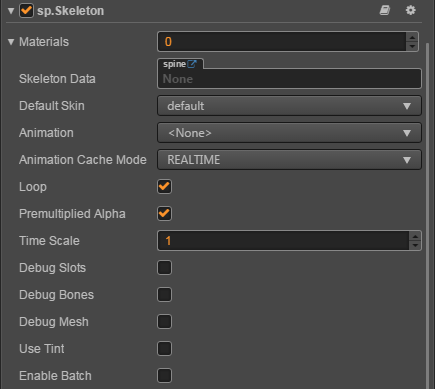

# Spine 组件参考

Spine 组件支持 Spine 导出的数据格式，并对骨骼动画（Spine）资源进行渲染和播放。

选中节点，点击 **属性检查器** 下方的 **添加组件 -> 渲染组件 -> Spine Skeleton** 按钮，即可添加 Spine 组件到节点上。

Spine 的脚本接口请参考 [Skeleton API](../../../api/zh/classes/Skeleton.html)。

## Spine 属性

| 属性 |   功能说明
| ------------------ | ------------------ |
| Skeleton Data      | 骨骼信息数据，拖拽 Spine 导出后的骨骼资源到该属性中
| Default Skin       | 选择默认的皮肤
| Animation          | 当前播放的动画名称
| Render Mode        | 渲染模式，默认realtime模式。 realtime模式，实时运算，支持spine所有的功能。 sharedCache模式，将骨骼动画数据进行缓存并共享，相当于将骨骼动画转换为帧动画，拥有较高性能，较少内存占用，不支持动作融合和动作叠加，只支持动作开始和结束事件，适用于特效，npc动画等。 privateCache模式，与sharedCache类似，但不共享动画数据。
| Loop               | 是否循环播放当前动画
| Premultiplied Alpha| 图片是否启用贴图预乘，默认为 True。 当图片的透明区域出现色块时需要关闭该项，当图片的半透明区域颜色变黑时需要启用该项。
| Time Scale         | 当前骨骼中所有动画的时间缩放率
| Debug Slots        | 是否显示 slot 的 debug 信息
| Debug Bones        | 是否显示骨骼的 debug 信息
| Use Tint           | 是否开启染色效果，默认关闭。
| Enabled Batch      | 是否开启动画合批，默认关闭。 开启时，能减少drawcall，适合于大量且简单动画同时播放的情况。关闭时，drawcall会上升，但能减少cpu的运算负担，适用于复杂的动画。

**注意**：当使用 Spine 组件时，**属性检查器** 中 Node 组件上的 **Anchor** 与 **Size** 属性是无效的。
