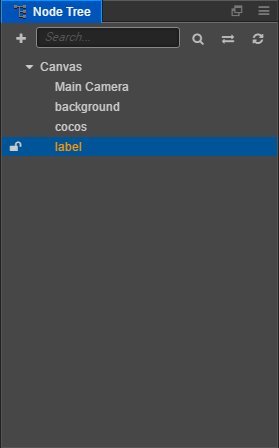
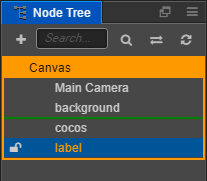

# Node Tree 层级管理器

**层级管理器** 中包括当前打开场景中的所有节点，不管节点是否包括可见的图像。你可以在这里选择、创建和删除节点，也可以通过拖拽一个节点到另一个上面来建立节点父子关系。

点击来选中节点，被选中的节点会以蓝底色高亮显示。当前选中的节点会在 **场景编辑器** 中显示蓝色边框，并更新 **属性检查器** 中的内容。

## 创建节点

在层级管理器中有两种方法可以创建节点：

- 点击左上角的 `+` 按钮，或右键点击鼠标并进入右键菜单中的**创建节点**子菜单。在这个子菜单中，你可以选择不同的节点类型，包括精灵（Sprite）、文字（Label）、按钮（Button）等有不同功能和表现节点。
- 从 **资源管理器** 中拖拽图片、字体或粒子等资源到层级管理器中。就能够用选中的资源创建出相应的图像渲染节点。

## 删除节点

选中节点后，通过右键菜单里`删除`选项，或按下<kbd>Delete</kbd>（Windows）或<kbd>Cmd + Backspace</kbd>热键即可删除选中的节点。如果选中节点包括子节点，子节点也会被一起删除。

## 建立和编辑节点层级关系

将节点A拖拽到节点B上，就使节点A成为节点B的子节点。和[资源管理器](assets.md)类似，层级管理器中也通过树状视图表示节点的层级关系。点击节点左边的三角图标，即可展开或收起子节点列表。

## 更改节点的显示顺序

除了将节点拖到另一个节点上，你还可以继续拖拽节点上下移动，来更改节点在列表中的排序。橙色的方框表示节点所属父节点的范围，绿色的线表示节点将会被插入的位置。

节点在列表中的排序决定了节点在场景中的显示次序。在层级管理器中位置越靠下的节点，在场景中的渲染就会更晚，也就会覆盖列表中位置较为靠上的节点。

## 其他操作

右键点击节点弹出的菜单里还包括下列操作：

- **拷贝/粘贴**：将节点复制到剪贴板上，然后可以粘贴到另外的位置，或打开另一个场景来粘贴刚才拷贝的节点。
- **复制节点**：生成和选中节点完全相同的节点副本，生成节点和选中节点在同一层级中。
- **重命名**：将节点改名。
- **在控制台显示路径**：在复杂场景中，我们有时候需要获取节点的完整层级路径，以便在脚本运行时访问该节点。点击这个选项，就可以在**控制台**中看到节点的路径。

---

继续前往[属性检查器](properties.md)说明文档。
