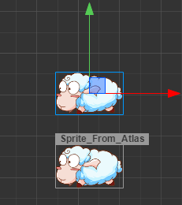
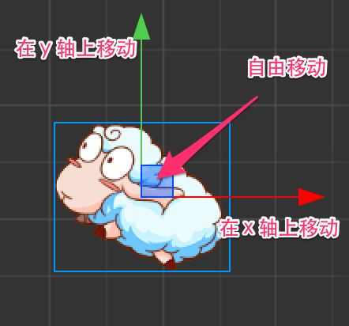
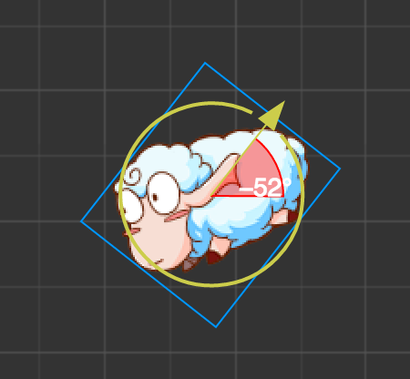
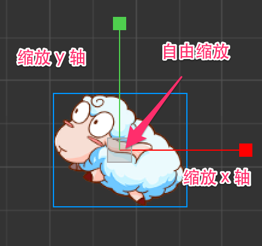

# Scene 场景编辑器

**场景编辑器**是内容创作的核心工作区域，您将使用它选择和摆放场景图像、角色、特效、UI 等各类游戏元素。在这个工作区域里，您可以选中并通过**变换工具**修改节点的位置、旋转、缩放、尺寸等属性，并可以获得所见即所得的场景效果预览。

## 视图介绍

### 导航

您可以通过以下的操作，来移动和定位**场景编辑器**的视图：

- <kbd>鼠标右键拖拽</kbd>：平移视图。
- <kbd>鼠标滚轮</kbd>：以当前鼠标悬停位置为中心缩放视图。

### 坐标系和网格

场景视图的背景会显示一组标尺和网格，表示**世界坐标系**中各个点的位置信息。读数为`(0,0)`的点为场景中世界坐标系的原点。使用鼠标滚轮缩小视图显示时，每一个刻度代表`100`像素的距离。根据当前视图缩放尺度的不同，会在不同刻度上显示代表该点到原点距离的数字，单位都是像素。

场景中的标尺和网格是我们摆放场景元素时位置的重要参考信息，关于坐标系和位置等节点属性的关系，请阅读[坐标系和变换](../../../content-workflow/transform.md)一节。

### 设计分辨率指示框

视图中的紫色线框表示场景中默认会显示的内容区域，这块区域的大小由**设计分辨率**决定。关于设计分辨率的设置和效果请阅读[Canvas组件参考](../../../components/canvas.md)一节。

## 选取节点

鼠标悬浮到场景中的节点上时，节点的约束框将会以灰色单线显示出来。此时单击鼠标，就会选中该节点。选择节点是使用变换工具设置节点位置、旋转、缩放等操作的前提。

选中的节点周围将会有蓝色的线框提示节点的约束框。

### 节点名称提示

鼠标悬浮在节点上时，与节点的约束框同时显示的还有节点的名称，在节点比较密集时可以先根据悬浮提示确定要选择的目标，然后点击确认您的选择。

关于节点的命名，请阅读[层级管理器](node-tree.md)的介绍内容。

### 节点的约束框

节点在鼠标悬浮或选中状态下都能够看到约束框（灰色或蓝色的线框），约束框的矩形区域表示节点的尺寸（**size**）属性大小。即使节点没有包含图像渲染组件（如**Sprite**），也可以为节点设置`size`属性，而节点约束框以内的透明区域都可以被鼠标悬浮和点击选中。

节点的尺寸（`size`）属性在多分辨率适配和排版策略中有非常重要的作用，关于节点尺寸使用的更多信息请阅读[多分辨率适配和元素对齐](../../../ui/multi-resolution.md)的相关内容。

### 多选节点

在**场景编辑器**中按住鼠标左键并拖拽，可以画出一个蓝色覆盖的选取框，和选取框有部分重合的节点，在放开鼠标按键后都会被一起选中。在放开鼠标键之前可以任意滑动鼠标来更改选取框的区域。

选中多个节点后，进行的任何变换操作都会同时作用于所有选中的节点。

## 使用变换工具布置节点

**场景编辑器**的核心功能就是以所见即所得的方式编辑和布置场景中的可见元素。我们主要通过主窗口工具栏左上角的一系列**变换工具**来将场景中的节点按我们希望的方式布置。

### 移动变换工具

**移动变换工具**是打开编辑器时默认处于激活状态的变换工具，之后这个工具也可以通过点击位于主窗口左上角工具栏第一个按钮来激活。

选中任何节点，就能看到节点中心（或锚点所在位置）上出现了由红绿两个箭头和蓝色方块组成的移动控制手柄（gizmo）。

**控制手柄**是指场景编辑器中在特定编辑状态下显示出的可用鼠标进行交互操作的控制器。这些控制器只用来辅助编辑，不会在游戏运行时显示。

移动变换工具激活时：

- 按住红色箭头拖拽鼠标，将在 x 轴方向上移动节点；
- 按住绿色箭头拖拽鼠标，将在 y 轴方向移动节点；
- 按住蓝色方块拖拽鼠标，可以同时在两个轴向自由移动节点。

场景编辑器处在激活状态时，按下快捷键<kbd>W</kbd>，即可随时切换到移动变换工具。

### 旋转变换工具

点击主窗口左上角工具栏第二个按钮，或在使用场景编辑器时按下<kbd>E</kbd>快捷键，即可激活**旋转变换工具**。

旋转变换工具的手柄主要是一个箭头和一个圆环组成，箭头所指的方向表示当前节点旋转属性（`rotation`）的角度。拖拽箭头或圆环内任意一点就可以旋转节点，放开鼠标之前，可以在控制手柄上看到当前旋转属性的角度值。

### 缩放变换工具

点击主窗口左上角工具栏第三个按钮，或在使用场景编辑器时按下<kbd>R</kbd>快捷键，即可激活**缩放变换工具**。

- 按住红色方块拖拽鼠标，在 x 轴方向上缩放节点图像；
- 按住绿色方块拖拽鼠标，在 y 轴方向上缩放节点图像；
- 按住中间的黄色方块，保持宽高比的前提下整体缩放节点图像。

缩放节点时，会同比缩放所有的子节点。

### 矩形变换工具

点击主窗口左上角工具栏第四个按钮，或在使用场景编辑器时按下<kbd>T</kbd>快捷键，即可激活**矩形变换工具**。

拖拽控制手柄的任一顶点，可以在保持对角顶点位置不变的情况下，同时修改节点尺寸中的`width`和`height`属性。

拖拽控制手柄的任一边，可以在保持对边位置不变的情况下，修改节点尺寸中的`width`或`height`属性。

在UI元素的排版中，经常会需要使用 **矩形变换工具** 直接精确控制节点四条边的位置和长度。而对于必须保持原始图片宽高比的图像元素，通常不会使用矩形变换工具来调整尺寸。

---

继续前往[层级管理器](node-tree.md)说明文档。
