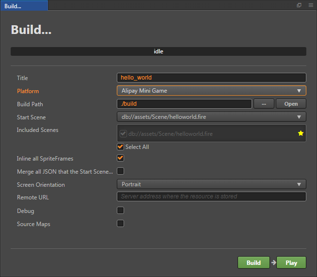

# 发布到支付宝小游戏

Cocos Creator 从 v2.1.3 版本开始正式支持将游戏发布到支付宝小游戏。

## 环境配置

- 桌面端下载 [支付宝小程序开发者工具]()（链接后续补充）并安装。

- 下载 [支付宝]()（后续补充），并安装到 Android 设备上。

- 建议 Android OS 版本在 **4.3** 或以上。

- Android 支付宝客户端最低支持版本 **10.1.72**。

## 发布流程

一、使用 Cocos Creator 打开需要发布的项目工程，在 **构建发布** 面板的 **发布平台** 中选择 **Alipay Mini Game**。然后点击 **构建**。

二、构建完成后，会在发布包的目录下生成一个 **alipay** 的支付宝小游戏工程文件夹，其中已经包含了支付宝小游戏环境的配置文件：`game.json`。

三、使用 **支付宝开发者工具** 打开构建生成的 **alipay** 文件夹，即可打开支付宝小游戏项目以及预览调试游戏内容。**支付宝开发者工具** 的使用方式请参考 [支付宝开发者工具文档]()（后续补充）。

## 支付宝小游戏环境的资源管理

支付宝小游戏与微信小游戏类似，都存在着包体限制，超过 **4MB** 的额外资源，必须通过网络请求下载。

我们建议用户只保存脚本文件在小游戏包内，其他资源都从远程服务器下载。Cocos Creator 已经帮用户做好了远程资源的下载、缓存和版本管理。具体的实现逻辑和微信小游戏类似，详情可参考 [微信小游戏资源管理](./publish-wechatgame.md#小游戏环境的资源管理)。

具体来说，开发者需要做的是：

1. 构建时，设置 **远程服务器地址**，然后点击 **构建**。
2. 构建完成后将支付宝小游戏发布包目录下的 res 文件夹完整的上传到服务器。
3. 删除本地发布包目录下的 res 文件夹。

## 支付宝小游戏已知问题：

目前暂时仅支持 Android 平台。

此外，我们对支付宝小游戏的适配工作还未完全结束，目前仍不支持以下模块：

- WebView
- VideoPlayer
- 分包加载
- 自定义字体

以上功能预计在以后的更新中会逐步支持，我们也将持续与支付宝小游戏的工程师们紧密沟通，不断优化适配效果。

## 参考链接

- [支付宝小游戏注册指导文档]()（后续补充）
- [支付宝开发者工具文档]()（后续补充）
- [支付宝小游戏 API 文档]()（后续补充）
