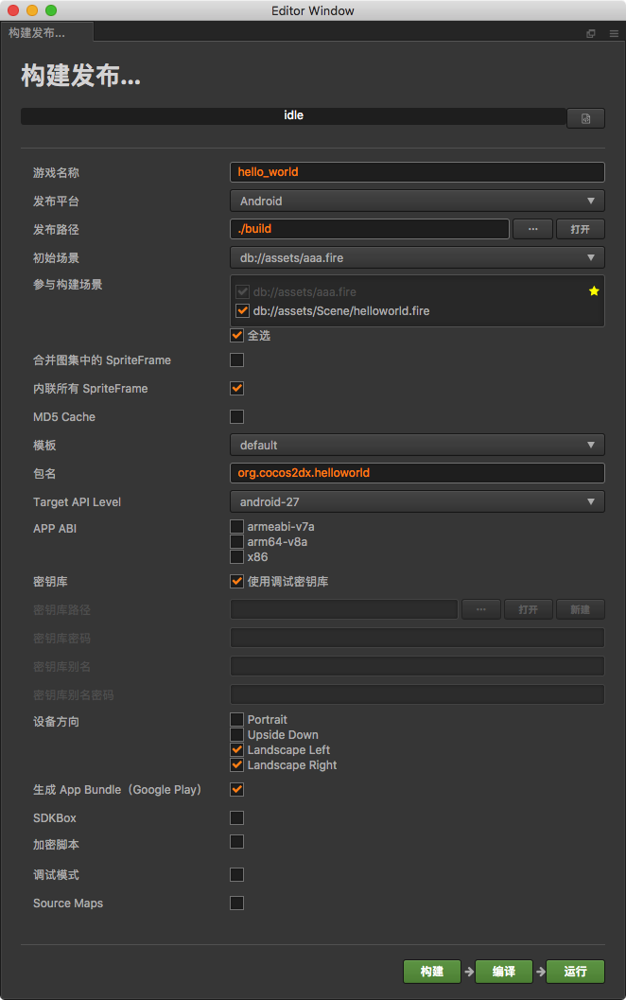
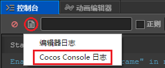
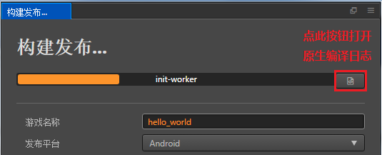
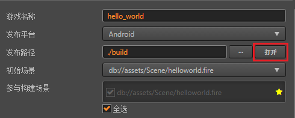
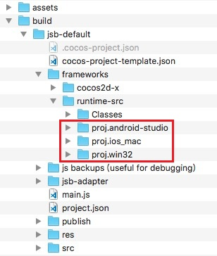

# 打包发布原生平台

点击菜单栏的 **项目 -> 构建发布**，打开构建发布面板。

目前可以选择的原生平台包括 Android、iOS、Mac、Windows 四个，其中发布到 iOS、Mac 和 Windows 的选项只能在相应的操作系统中才会出现。



## 构建选项

### 合并图集中的 SpriteFrame

将图集中的全部 SpriteFrame 合并到同一个包中。默认关闭，启用后能够减少热更新时需要下载的 SpriteFrame 文件数量，但如果图集中的 SpriteFrame 数量很多，则可能会延长原生平台上的启动时间。

### 内联所有 SpriteFrame

自动合并资源时，将所有 SpriteFrame 与被依赖的资源合并到同一个包中。建议网页平台开启，启用后会略微增大总包体，多消耗一点点网络流量，但是能显著减少网络请求数量。建议原生平台关闭，因为会增大热更新时的体积。

### MD5 Cache

给构建后的所有资源文件名将加上 MD5 信息，解决热更新时的 CDN 资源缓存问题。
启用后，如果出现资源加载不了的情况，说明找不到重命名后的新文件。这通常是因为有些 C++ 中用到的第三方资源没通过 cc.loader 加载引起的。这时可以在加载前先用以下方法转换 url ，转换后的路径就能正确加载。

```cpp
auto cx = ScriptingCore::getInstance()->getGlobalContext();
JS::RootedValue returnParam(cx);
ScriptingCore::getInstance()->evalString("cc.loader.md5Pipe.transformURL('url')", &returnParam);

string url;
jsval_to_string(cx, returnParam, &url);
```

### 设置包名（Package Name）

设置包名该项为 Android 平台特有的。选择 Android 平台后，构建发布窗口中会显示 **包名** 的输入框，在这里请输入您游戏的包名（也称作 Package Name 或 Bundle ID），通常以产品网站 url 倒序排列，如 `com.mycompany.myproduct`。

**注意**：包名中只能包含数字、字母和下划线，此外包名最后一部分必须以字母开头，不能以下划线或数字开头。


### Target API Level

设置编译 Android 平台所需的 Target API Level。

### APP ABI

设置 Android 需要支持的 CPU 类型，可以选择一个或多个选项，分别有 **armeabi-v7a**、**arm64-v8a**、**x86** 三种类型。

**注意**：

- 当你选择一个 ABI 构建完成之后，在不 Clean 的情况下，构建另外一个 ABI，此时两个 ABI 的 so 都会被打包到 apk 中，这个是 Android Studio 默认的行为。若用 Android Studio 导入工程，选择一个 ABI 构建完成之后，先执行一下 **Build  -> Clean Project** 再构建另外一个 ABI，此时只有后面那个 ABI 会被打包到 apk 中。

- 项目工程用 Android Studio 导入后，是一个独立的存在，不依赖于构建面板。如果需要修改 ABI，直接修改 **gradle.properties** 中的 **PROP_APP_ABI** 属性即可。

    

### 密钥库

Android 要求所有 APK 必须先使用证书进行数字签署，然后才能安装。Cocos Creator 提供了默认的密钥库，勾选 **使用调试密钥库** 就是使用默认密钥库，若用户需要自定义密钥库可去掉 **使用调试密钥库** 勾选。具体请参考 [官方文档](https://developer.android.com/studio/publish/app-signing?hl=zh-cn)（需要使用 VPN）

### 生成 App Bundle (Google Play)

Creator 在 **v2.0.9** 中新增了 **App Bundle (Google Play)** 选项。如果选择 Android 或者 Android Instant 平台，勾选该项即可将游戏打包成 App Bundle 格式用于上传到 Google Play 商店。具体请参考 [官方文档](https://developer.android.com/guide/app-bundle/)（需要使用 VPN）

### SDKBox

SDKBox 是免费的让移动游戏开发人员简单轻松集成第三方 SDK 的工具，主要面向海外的各种平台和服务。支持苹果和谷歌的 IAP 内购等近 30 种 SDK，所有的 SDK 都经过严格的测试与官方认证。详情请参考 [SDKBox](../sdk/sdkbox.md)。

### 加密脚本

加密发布后的脚本。会在构建后的 `src` 目录下生成 jsc 文件，这个文件是加密过的。而 js 文件会备份在 `js backups` 目录下以便调试，打包时不会进入 APP 中。

**脚本加密密钥**：在 Native 平台上会使用这个值作为加密 js 文件的密钥。项目新建时会随机生成

**Zip 压缩**：勾选上的话可以减小脚本体积


## 选择源码

在 **模板** 下拉菜单中有两种可用的引擎模板，我们可以从中选择一种：

- default，使用默认的 cocos2d-x 源码版引擎构建项目
- link，与 default 模板不同的是，link 模板不会拷贝 cocos2d-x 源码到构建目录下，而是使用共享的 cocos2d-x 源码。这样可以有效减少构建目录占用空间，以及对 cocos2d-x 源码的修改可以得到共享。

### 源码引擎

cocos2d-x 引擎中包括源码引擎。他们适用的范围是：

- 源码引擎初次构建和编译某个工程时需要很长的时间编译 C++ 代码，视电脑配置而定，这个时间可能在 5~20 分钟。对于同一个项目，已经编译过一次之后，下次再编译需要的时间会大大缩短。
- 源码引擎构建出的工程，使用原生开发环境编译和运行（如 Android Studio、Xcode 等 IDE），是可以进行调试和错误捕获的。

目前 Cocos Creator 安装目录下已经包含了自带的 cocos2d-x 源码引擎。如果您想了解编译的进度，请点击 **控制台** 面板的日志按钮，并选择 **Cocos Console 日志** 来打开相应的日志文件。



## 构建原生工程

选择发布平台，设置了初始场景后，就可以开始构建了，点击右下角的 **构建** 按钮，开始构建流程。



编译脚本和打包资源时会在窗口上方显示进度条，进度条到达 100% 后请继续等待 **控制台** 面板中的工程构建结束，成功的话会显示如下所示的日志：

```bash
Built to "\myProject\example\build\jsb-default" successfully
```

构建结束后，我们得到的是一个标准的 cocos2d-x 工程，和使用 Cocos Console 新建的工程有同样的结构。接下来我们可以选择通过 Cocos Creator 编辑器的进程进行编译，以及运行桌面预览，或手动在相应平台的 IDE 中打开构建好的原生工程，进行进一步的预览、调试和发布。

## 通过编辑器编译和预览

点击下方的 **编译** 按钮，进入编译流程，如果模板选择了 `default` 的源码版引擎，这个编译的过程将会花费比较久的时间。编译成功后会提示

`Compile native project successfully`

**注意：首次编译 Android 平台或者版本升级后，建议通过 Android Studio 打开工程，根据提示下载缺失的工具，再进行编译运行。**

接下来就可以点击右下角的 **运行** 按钮，通过默认方式预览原生平台的游戏。


点击运行后，视平台不同可能还会继续进行一部分编译工作，请耐心等待或通过日志文件查看进展。

其中 Mac/Windows 平台直接在桌面运行预览，iOS 平台会调用模拟器运行预览，Android 平台必须通过 USB 连接真机，并且在真机上开启 USB 调试后才可以运行预览。

iOS 平台建议通过 Xcode 连接真机进行编译运行。构建完成后使用 Xcode 打开构建目录下的 `frameworks\runtime-src\proj.ios_mac\.xcodeproj` 文件，在 Xcode 面板 `General -> Signing` 中设置签名，在 Xcode 左上方选择连接的设备后点击编译按钮进行编译运行。


## 使用原生工程

点击发布路径旁边的 **打开** 按钮，就会在操作系统的文件管理器中打开构建发布路径。



这个路径中的 `jsb-default` 或 `jsb-link` （根据选择模板不同）里就包含了所有原生构建工程。



图中红框所示的就是不同原生平台的工程，接下来您只要使用原生平台对应的 IDE （如 Xcode、Android Studio、Visual Studio）打开这些工程，就可以进行进一步的编译、预览、发布操作了。关于原生平台 IDE 的使用请搜索相关信息，这里就不再赘述了。

**注意**：在 MIUI 10 系统上运行 debug 模式构建的工程可能会弹出 “Detected problems with API compatibility” 的提示框，这是 MIUI 10 系统自身引入的问题，使用 release 模式构建即可。

---

要了解如何在原生平台上调试：

如果 Creator 版本为 v1.7 以上请参考 [原生平台 JavaScript 调试](debug-jsb.md)。

如果 Creator 版本为 v1.6 以下请参考 [原生平台调试](debug-native.md)。