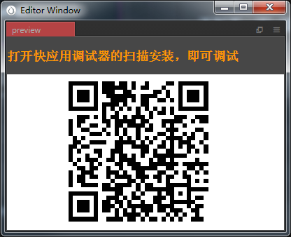

# 发布到 vivo 小游戏

Cocos Creator 从 v2.0.5 版本开始正式支持将游戏发布到 vivo 小游戏。目前本文档是基于 v2.0.6 编写的，这是推荐使用的最低版本。如果您使用的是 v2.0.5，建议升级到 v2.0.6。下面我们来看一下具体的发布流程。

## 环境配置

- 下载 [快应用 & vivo 小游戏调试器](https://dev.vivo.com.cn/documentCenter/doc/163) 和 [vivo 小游戏引擎](https://dev.vivo.com.cn/documentCenter/doc/163)，并安装到 Android 设备上（建议 Android Phone 6.0 或以上版本）

- 全局安装 [nodejs-8.1.4](https://nodejs.org/zh-cn/download/) 或以上版本

    **注意**：安装 nodejs 后，需要注意 npm 源地址是否为 https://registry.npmjs.org/

    ```bash
    # 查看当前 npm 源地址
    npm config get registry
    # 若不是，重新设置 npm 源地址
    npm config set registry https://registry.npmjs.org/
    ```

- 全局安装 qgame-toolkit。确定 npm 源地址后，安装 qgame-toolkit：

    ```bash
    npm install -g qgame-toolkit
    ```

## 发布流程

一、使用 Cocos Creator 打开需要发布的项目工程，在 **构建发布** 面板的 **发布平台** 中选择 **vivo 小游戏**。


**必填参数项**：根据用户的需求及参数输入框的提示信息进行填写，包括：**应用包名**、**应用名称**、**应用图标**、**应用版本名称**、**应用版本号**、**支持的最小平台版本号**。

**选填参数项**：包括 **小包模式**、**小包模式服务器路径**、**自定义 npm 文件夹路径（v2.0.9 中新增）**。

而 **密钥库** 以及两个签名文件（**certificate.pem 路径** 和 **private.pem 路径**），需要根据用户需求选择勾选 **密钥库** 或者填写两个路径。相关参数配置具体的填写规则如下：

相关参数配置具体的填写规则如下：

- **应用包名**

  该项为必填项，根据用户的需求进行填写。

- **应用名称**

  该项为必填项。是 vivo 小游戏的名称。而 **构建发布** 面板最上方的 **游戏名称** 则不参与 vivo 小游戏打包流程。

- **桌面图标**

  **桌面图标** 为必填项。点击输入框后面的 **...** 按钮选择所需的图标。构建时，图标将会被构建到 vivo 小游戏的工程中。**桌面图标** 建议使用 **.png** 图片。

- **应用版本名称**

  该项为必填项。**应用版本名称** 是真实的版本，如：1.0.0

- **应用版本号**

  该项为必填项。**应用版本号** 与 **应用版本名称** 不同，**应用版本号** 主要用于区别版本更新。每次提交审核时应用版本号都要比上次提交审核的值至少 +1，一定不能等于或者小于上次提交审核的值，建议每次提交审核时应用版本号递归 +1。**注意**：**应用版本号** 必须为正整数。

- **支持的最小平台版本号**

  该项为必填项。具体填写值可通过点击 [更新记录](http://minigame.vivo.com.cn/documents/#/download/engine?id=%E6%9B%B4%E6%96%B0%E8%AE%B0%E5%BD%95%EF%BC%9A) 来查看最新的 vivo 引擎版本号。

- **小包模式和小包模式服务器路径**

  该项为选填项。小游戏的包内体积包含代码和资源不能超过 4M，资源可以通过网络请求加载。**小包模式** 就是帮助用户将脚本文件保留在小游戏包内，其他资源则上传到远程服务器，根据需要从远程服务器下载。而远程资源的下载、缓存和版本管理，Creator 已经帮用户做好了。用户需要做的是以下两个步骤：

  1、构建时，勾选 **小包模式**，填写 **小包模式服务器路径**。然后点击 **构建**。

  2、构建完成后，点击 **发布路径** 后面的 **打开** 按钮，将发布路径下的 **qgame/res** 目录上传到小包模式服务器。例如：默认发布路径是 build，则需要上传 **build/qgame/res** 目录。
  **注意**：如果是命令行编译小包模式，记得备份 **build/qgame/res** 目录，然后删除 **build/qgame/res** 目录，再进行命令行编译（npm run build）。

  此时，构建出来的 rpk 将不再包含 res 目录，res 目录里的资源将通过网络请求从填写的 **小包模式服务器路径** 上下载。

- **密钥库**

  勾选 **密钥库** 时，表示默认用的是 Creator 自带的证书构建 rpk 包，仅用于 **测试和调试** 时使用。<br>
  如果不勾选 **密钥库**，则需要配置签名文件 **certificate.pem 路径** 和 **private.pem 路径**，此时构建出的是可以 **直接发布** 的 rpk 包。用户可通过输入框右边的 **...** 按钮来配置两个签名文件。**注意**：这两个签名文件建议不要放在发布包 **build/qgame** 目录下，否则每次构建时都会清空该目录，导致文件丢失。

  有以下两种方式可以生成签名文件：

    - 通过 **构建发布** 面板 **certificate.pem 路径** 后的 **新建** 按钮生成。

    - 通过命令行生成 release 签名

      用户需要通过 openssl 命令等工具生成签名文件 private.pem、certificate.pem。其中在 build/qgame/sign/debug 目录下的证书仅供调试使用。

      ```bash
      # 通过 openssl 命令工具生成签名文件
      openssl req -newkey rsa:2048 -nodes -keyout private.pem -x509 -days 3650 -out certificate.pem
      ```

      **注意**：openssl 工具在 linux 或 Mac 环境下可在终端直接打开，而在 Windows 环境下则需要安装 openssl 工具并且配置系统环境变量。

- **自定义 npm 文件夹路径**

  该项为选填项，从 **v2.0.10** 开始可以自动获取到操作系统全局的 npm 路径，无需再手动设置。获取方法为：
  
  - Windows 系统：从系统获取环境变量中的路径
  - Mac 系统：从 Shell 的配置文件获取环境变量中的路径。
  
  如果获取不到，请确保 npm 已正常安装，并且能够在命令行环境下直接启动。获取到的 npm 将用于构建生成可运行的小游戏 rpk 包（rpk 包位于构建生成的小游戏工程 qgame 目录下的 dist 目录）。如果构建时找不到 npm 文件夹路径，则 Creator 只会导出小游戏工程目录，不会生成 rpk 包。

  **V2.0.10** 以下版本的填写规则如下：
  
  - 若不填写该项时，Creator 会默认在 Windows 系统上读取环境变量中的 npm 路径，在 Mac 系统上默认读取 **/usr/bin/local** 目录下的 npm 来构建导出可运行的小游戏 rpk 包。
  - 如果用户的电脑环境未安装 npm 或者读取不到系统中的 npm 路径时，则需要填写 **自定义 npm 文件夹路径** 来构建导出 rpk 包。填写规则如下：

    - Windows 系统

      ```bash
      # 获取本地 npm 安装路径
      where npm
      # 如果输出结果为：
      C:\Program Files\nodejs\npm
      # 则自定义 npm 文件夹路径填写为：
      C:\Program Files\nodejs
      ```

    - Mac 系统

      ```bash
      # 获取本地 npm 安装路径
      which npm
      # 如果输出结果为：
      /Users/yourname/.nvm/versions/node/v8.1.4/bin/npm
      # 则自定义 npm 文件夹路径填写为：
      /Users/yourname/.nvm/versions/node/v8.1.4/bin
      ```

二、**构建发布** 面板的相关参数设置完成后，点击 **构建**。构建完成后点击 **发布路径** 后面的 **打开** 按钮来打开构建发布包，可以看到在默认发布路径 build 目录下生成了 **qgame** 目录，该目录就是导出的 vivo 小游戏工程目录。


并且在 /build/qgame/dist 目录下会生成 rpk 包。


三、将打包出来的 rpk 运行到手机上。有以下三种方式可将 rpk 运行到手机上：

- **方法一**：

    在 **构建发布** 面板点击 **运行** 按钮，等待二维码界面生成

    

    然后在 Android 设备上打开之前已经安装完成的 **快应用 & vivo 小游戏调试器**，点击 **扫码安装** 按钮直接扫描二维码即可打开 rpk。

    

- **方法二**：

    将构建生成的小游戏 rpk 文件（位于小游戏工程 qgame 目录下的 dist 目录中）拷贝到手机 sdcard 目录下。

    在 Android 设备上打开之前已经安装完成的 **快应用 & vivo 小游戏调试器**，点击 **本地安装**，然后从手机 sdcard 目录中找到 rpk 文件，选择打开即可。

    

- **方法三**：

    利用 vivo 小游戏打包工具命令生成网址和二维码

    ```bash
    # 先把命令行指定到 qgame 目录下
    cd E:\workspace\YourProject\build\qgame
    # 生成网址和二维码
    npm run server
    ```

    然后在 Android 设备上打开之前已经安装完成的 **快应用 & vivo 小游戏调试器**

    最后点击 **扫码安装** 按钮，将第一步中生成的网址拷贝到浏览器，然后直接扫描网页上的二维码即可打开 rpk。

## 参考链接

- [vivo 小游戏开发文档](http://minigame.vivo.com.cn/documents/lesson/debug.html#chrome%E6%B5%8F%E8%A7%88%E5%99%A8%E7%9C%9F%E6%9C%BA%E8%B0%83%E8%AF%95)
- [vivo 小游戏 API 文档](http://minigame.vivo.com.cn/documents/api/system/life-cycle.html)
- [快应用 & vivo 小游戏调试器下载](http://minigame.vivo.com.cn/documents/download/engine.html)
