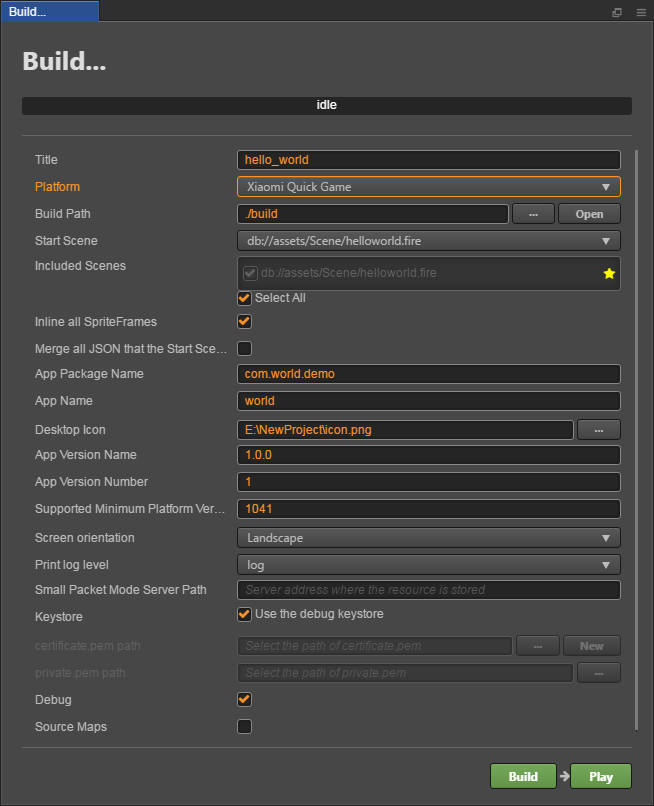

# 发布到小米快游戏平台

Cocos Creator 从 v2.0.10 版本开始正式支持将游戏发布到小米快游戏平台。我们来看一下如何使用 Cocos Creator 发布到小米快游戏平台。

## 环境配置

- 下载 [小米快游戏调试器](https://dev.mi.com/console/doc/detail?pId=1704)，并安装到小米设备上（MIUI 8.5.0 或以上版本）。
- 下载 [小米快应用服务框架](https://dev.mi.com/console/doc/detail?pId=1704)，并安装到小米设备上。
- PC 端全局安装 [nodejs-8.1.4](https://nodejs.org/zh-cn/download/) 或以上版本。
- PC 端全局安装 npm-5.2.0 或以上版本。升级 npm 命令如下：

  ```bash
  # 查看 npm 版本
  npm -v
  # 若 npm 版本在 5.2.0 以下，可使用以下升级命令升级 npm 
  npm install npm@latest -g
  ```

## 发布流程

一、使用 Cocos Creator 打开需要发布的项目工程，在 **构建发布** 面板的 **发布平台** 中选择 **小米快游戏**。



相关参数配置具体的填写规则如下：

- **应用包名**

  该项为必填项，根据用户的需求进行填写。

- **应用名称**

  该项为必填项。是小米快游戏的名称。**构建发布** 面板最上方的 **游戏名称** 则不参与小米快游戏打包流程。

- **桌面图标**

  该项为必填项。构建时 **桌面图标** 将会构建到小米快游戏的工程中。点击输入框右边的 **...** 按钮即可选择图片。桌面图标建议使用 **png** 图片。

- **应用版本名称**

  该项为必填项，根据用户的需求进行填写。

- **应用版本号**

  该项为必填项，根据用户的需求进行填写。

- **支持的最小平台版本号**

  该项为必填项。根据小米的要求目前这个值必须大于或等于 **1041**。

- **小包模式服务器路径**

  该项为选填项。快游戏的包内体积包含代码和资源不能超过 10M，资源可以通过网络请求加载。**小包模式** 就是帮助用户将脚本文件保留在快游戏包内，其他资源则上传到远程服务器，根据需要从远程服务器下载。而远程资源的下载、缓存和版本管理，Creator 已经帮用户做好了。用户需要做的是以下两个步骤：

  1、构建之前，填写 **小包模式服务器路径**。然后点击 **构建**。

  2、构建完成后，点击 **发布路径** 后面的 **打开** 按钮，将发布路径下的 **xiaomi/res** 目录上传到小包模式服务器。例如：默认发布路径是 build，则需要上传 build/xiaomi/res 目录。

  此时，构建出来的 rpk 将不再包含 res 目录，res 目录里的资源将通过网络请求从填写的 **小包模式服务器地址** 上下载。

- **密钥库**

  勾选 **密钥库** 时，表示默认使用的是 Creator 自带的证书构建 rpk 包，仅用于 **调试** 时使用。**注意**：若 rpk 包要用于提交审核，则构建时不要勾选该项。<br>
  如果不勾选 **密钥库**，则需要配置签名文件 **certificate.pem 路径** 和 **private.pem 路径**，此时构建出的是可以 **直接发布** 的 rpk 包。用户可通过输入框右边的 **...** 按钮来配置两个签名文件。**注意**：这两个签名文件需要指定到发布包 `\build\xiaomi\sign\release` 目录下。

  有以下两种方式可以生成签名文件：

    - 通过 **构建发布** 面板 **certificate.pem 路径** 后的 **新建** 按钮生成。

    - 通过命令行生成 release 签名

      用户需要通过 openssl 命令等工具生成签名文件 private.pem、certificate.pem。

      ```bash
      # 通过 openssl 命令工具生成签名文件
      openssl req -newkey rsa:2048 -nodes -keyout private.pem -x509 -days 3650 -out certificate.pem
      ```

      **注意**：openssl 工具在 linux 或 Mac 环境下可在终端直接打开。而在 Windows 环境下则需要安装 openssl 工具并且配置系统环境变量，配置完成后需重启 Creator。

二、**构建发布**

  **构建发布** 面板的相关参数设置完成后，点击 **构建**。构建完成后点击 **发布路径** 后面的 **打开** 按钮来打开构建发布包，可以看到在默认发布路径 build 目录下生成了 **xiaomi** 目录，该目录就是导出的小米快游戏工程目录和 rpk，rpk 包在 **/build/xiaomi/dist** 目录下。

  

三、**将打包出来的 rpk 运行到手机上**。有以下两种方式：

- **方法一**：

  - 在 **构建发布** 面板点击右下角的 **运行** 按钮，等待二维码界面生成。
  - 然后在小米设备上打开之前已经安装完成的 **快应用调试器**，点击 **扫码安装** 按钮，直接扫描二维码即可打开 rpk。
  
    
  
- **方法二**：

  - 将构建生成的快游戏 rpk 文件（位于发布包 **build/xiaomi/dist** 目录下）拷贝到手机 sdcard 目录中。
  - 在小米设备上打开之前已经安装完成的 **快应用调试器**，点击 **本地安装**，然后从手机 sdcard 目录中找到 rpk 文件，选择打开即可。
    
    

四、分包 rpk

分包 rpk 是根据用户的需求选择是否使用。分包加载，即把游戏内容按一定规则拆分在几个包里，在首次启动的时候只下载必要的包，这个必要的包称为 **主包**，开发者可以在主包内触发下载其他子包，这样可以有效降低首次启动的消耗时间。若要使用该功能需要在 Creator 中设置 [分包加载](../scripting/subpackage.md)，设置完成后在构建时就会自动分包。**注意**：单个分包/主包大小不能超过 **4M**。

构建完成后，会生成 **.rpk** 和 **.rpks** 文件，生成目录在 **build/xiaomi/dist** 目录下。

## 相关参考链接

[小米快游戏开发者接入指南](https://dev.mi.com/console/doc/detail?pId=1704)
