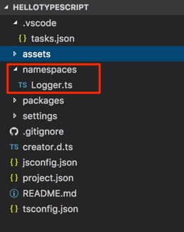
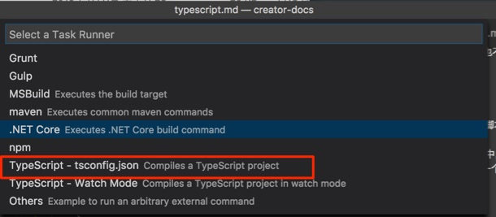

# 使用 TypeScript 脚本

TypeScript 是一种由微软开发的自由和开源的编程语言。它是 JavaScript 的一个严格超集，并添加了可选的静态类型和基于类的面向对象编程。TypeScript 的设计目标是开发大型应用，然后转译成 JavaScript 运行。由于 TypeScript 是 JavaScript 的超集，任何现有的 JavaScript 程序都是合法的 TypeScript 程序。

关于 TypeScript 的详细使用方法，请访问 [TypeScript官方网站](https://www.typescriptlang.org/)。

## TypeScript 和 Cocos Creator

Cocos Creator 的很多用户之前是使用其他强类型语言（如 C++/C#）来编写游戏的，因此在使用 Cocos Creator 的时候也希望能够使用强类型语言来增强项目在较大规模团队中的表现。

从 v1.5 版本开始 Cocos Creator 支持在项目中使用 TypeScript 编写脚本，用户的源码可以完全使用 TypeScript，或者 TypeScript 和 JavaScript 混合使用。

和其他 JavaScript 脚本一样，项目 `assets` 目录下的 TypeScript 脚本（.ts 文件) 在创建或修改后激活编辑器，就会被编译成兼容浏览器标准的 ES5 JavaScript 脚本。编译后的脚本存放在项目下的 `library`（还包括其他资源）目录。

## 使用准备

### 在新项目中使用 TypeScript

新建项目时，从项目模板中选择 **HelloWorld TypeScript**，即可创建一个包括 TypeScript 相关设置和基本组件的 HelloWorld 项目。


在编辑 TypeScript 脚本时，我们推荐使用微软推出的 [VS Code](https://code.visualstudio.com/) 作为代码编辑器，VS Code 具有完善的 TypeScript 语言支持功能。

### 在已有项目中添加 TypeScript 设置

如果希望在原有项目中添加 TypeScript 脚本，并获得 VS Code 等 IDE 的完整支持，需要执行主菜单的 `开发者 -> VS Code 工作流 -> 更新 VS Code 智能提示数据` 和 `开发者 -> VS Code 工作流 -> 添加 TypeScript 项目配置`，来添加 `creator.d.ts` 和 `tsconfig.json` 文件到你的项目根目录中。`creator.d.ts` 声明了引擎的所有 API，用于支持 VS Code 的智能提示。`tsconfig.json` 用于设置 TypeScript 项目环境，您可以参考官方的 [tsconfig.json 说明](https://www.typescriptlang.org/docs/handbook/tsconfig-json.html) 进行定制。

### 在项目中创建 TypeScript 脚本

和创建 JavaScript 脚本一样，你可以直接在文本编辑器里新建 `.ts` 文件，或通过编辑器的 **资源管理器** 的创建菜单，右键点击一个文件夹，并选择 `新建 -> TypeScript`。

## 使用 TypeScript 声明 CCClass

在 [TypeScript 中 class 的声明方式](https://www.typescriptlang.org/docs/handbook/classes.html) 和 [ES6 Class](http://es6.ruanyifeng.com/#docs/class) 相似。但为了编辑器能够正确解析 **属性检查器** 里显示的各类属性，我们还需要使用引擎内置的一些装饰器，来将普通的 class 声明成 CCClass。这和目前将 JavaScript 中的 ES6 Class 声明为 CCClass 的方法类似。关于装饰器的更多信息请参考 [TypeScript decorator](http://www.typescriptlang.org/docs/handbook/decorators.html)。

下面是一个基本的 TypeScript 声明组件的实例：

```typescript
const {ccclass, property} = cc._decorator; // 从 cc._decorator 命名空间中引入 ccclass 和 property 两个装饰器

@ccclass // 使用装饰器声明 CCClass
export default class NewClass extends cc.Component { // ES6 Class 声明语法，继承 cc.Component

    @property(cc.Label) // 使用 property 装饰器声明属性，括号里是属性类型，装饰器里的类型声明主要用于编辑器展示
    label: cc.Label; // 这里是 TypeScript 用来声明变量类型的写法，冒号后面是属性类型

    // 也可以使用完整属性定义格式
    @property({
        default: 'hello'
    })
    text: string = 'hello';

    // 成员方法
    onLoad() {
        // init logic
    }
}
```

装饰器使用 `@` 字符开头作为标记，装饰器主要用于编辑器对组件和属性的识别，而 TypeScript 语法中的类型声明 `myVar: Type` 则允许 VS Code 编码时自动识别变量类型并提示其成员。

### 更多属性类型声明方法

声明值类型

```typescript
@property({
    default: 1,
    type: cc.Integer
})
myInteger = 1;

@property(cc.Node)
myNode: cc.Node = null;

@property
myOffset = new cc.Vec2(100, 100);
```

声明数组

```typescript
@property([cc.Node])
public myNodes: cc.Node[] = [];

@property([cc.Color])
public myColors: cc.Color[] = [];
```

声明 getset

```typescript
@property
_width = 100;

@property
get width () {
    return this._width;
}

@property
set width (value) {
    cc.log('width changed');
    return this._width = value;
}
```

注意：TypeScript 的 public, private 修饰符不影响成员在 **属性检查器** 中的默认可见性，默认的可见性仍然取决于成员变量名是否以下划线开头。

## 完善的智能提示功能

按照 **使用准备** 里描述的方式创建项目或添加配置后，在 VS Code 里打开项目，就可以享受完善的代码智能提示功能了。

### 组件本身的属性成员

只要输入 `this.` 就会自动提示组件本身的其他成员，输入 `this.member.` 可以继续提示该成员的属性或方法


### 提示其他组件属性和方法

首先我们声明一个组件：

```typescript
// MyModule.ts
const {ccclass, property} = cc._decorator;

@ccclass
export class MyModule extends cc.Component {
    @property(cc.String)
    myName : string;

    @property(cc.Node)
    myNode: cc.Node = null;
}
```

然后在其他组件中 import MyModule, 并且声明一个 `MyModule` 类型的成员变量：

```typescript
// MyUser.ts
const {ccclass, property} = cc._decorator;
import {MyModule} from './MyModule';

@ccclass
export class MyUser extends cc.Component {
    @property(MyModule)
    public myModule: MyModule = null;

    public onLoad() {
        // init logic
        this.myModule.myName = 'John';
    }
}
```

输入 `this.myModule.` 时，就可以提示我们在 `MyModule.ts` 中声明的属性了。


## 使用命名空间

在 TypeScript 里，命名空间是位于全局命名空间下的一个普通的带有名字的JavaScript对象。通常用于在使用全局变量时为变量加入命名空间限制，避免污染全局空间。命名空间和模块化是完全不同的概念，命名空间无法导出或引用，仅用来提供通过命名空间访问的全局变量和方法。关于命名空间和模块化更详细的解释请参阅官方文档 [命名空间和模块](https://zhongsp.gitbooks.io/typescript-handbook/content/doc/handbook/Namespaces%20and%20Modules.html)。

Creator 中默认所有 assets 目录下的脚本都会进行编译，自动为每个脚本生成模块化封装，以便脚本之间可以通过 `import` 或 `require` 相互引用。当希望把一个脚本中的变量和方法放置在全局命名空间，而不是放在某个模块中时，我们需要选中这个脚本资源，并在 **属性检查器** 里设置该脚本 `导入为插件`。设为插件的脚本将不会进行模块化封装，也不会进行自动编译。

所以对于包含命名空间的 TypeScript 脚本来说，我们既不能将这些脚本编译并进行模块化封装，也不能将其设为插件脚本（会导致 TS 文件不被编译成 JS）。如果需要使用命名空间，我们需要使用特定的工作流程。

### 命名空间工作流程

1. 在项目的根目录下（assets 目录外），新建一个文件夹用于存放我们所有包含命名空间的 ts 脚本，比如 `namespaces`。
    
2. 修改 `tsconfig.json` 文件，将刚创建的 `namespace` 文件夹加入到 `include` 字段中，表示我们将会通过 VSCode 编译这部分文件。
3. 在 `tsconfig.json` 的 `compilerOptions` 字段中，加入 `outFile` 字段，并设置一个 `assets` 文件夹下的文件路径。通过这些设置，我们会将所有 `namespace` 目录下的 ts 文件编译到 `assets` 目录下的某个 js 文件中。
    ```json
    {
        "compilerOptions": {
            "module": "commonjs",
            "lib": [ "dom", "es5", "es2015.promise" ],
            "target": "es5",
            "outFile": "./assets/Script/Lib/namespace.js",
            "experimentalDecorators": true
        },
        "include": [
            "namespaces"
        ]
    }
    ```
4. 按下 `Ctrl/Cmd + Shift + P`，在 Command Palette 里输入 `task`，并选择 `Tasks: Configure Task Runner`。在弹出的对话框里选择 `TypeScript - tsconfig`。这将在 `.vscode` 文件夹下新建一个 `tasks.json` 配置文件，并配置根据 `tsconfig.json` 来编译项目中指定的 ts 脚本的任务。
    
5. 现在你可以在 `namespace` 目录下书写包含命名空间的 ts 脚本了，编程完成后按下 `Ctrl/Cmd + Shift + B` 触发默认构建任务，就会将 `namespace` 里的脚本内容编译到 `assets` 目录下的指定文件里。 每次修改 `namespace` 中的脚本后，都应该执行构建任务来更新编译后的文件。
6. 回到 Creator 编辑器，在资源管理器里选中刚生成的 namespace 脚本 `namespace.js`，在属性检查里设置 「导入为插件」。避免编辑器对该脚本进行进一步的编译封装。

这就是在 Creator 里使用 TypeScript 命名空间的完整工作流程。


## 更新引擎接口声明数据

Creator 每个新版本都会更新引擎接口声明，建议升级了 Creator 后，通过主菜单的 `开发者 -> VS Code 工作流 -> 更新 VS Code 智能提示数据` 来更新已有项目的 `creator.d.ts` 文件。

---

Cocos Creator 中对 TypeScript 的支持参考了很多 [Creator TypeScript Boilerplate](https://github.com/toddlxt/Creator-TypeScript-Boilerplate) 项目的设置和做法，在此特别感谢。另外这个项目中也包含了很多关于使用 TypeScript 项目的工作流程和高级功能，可供参考。

