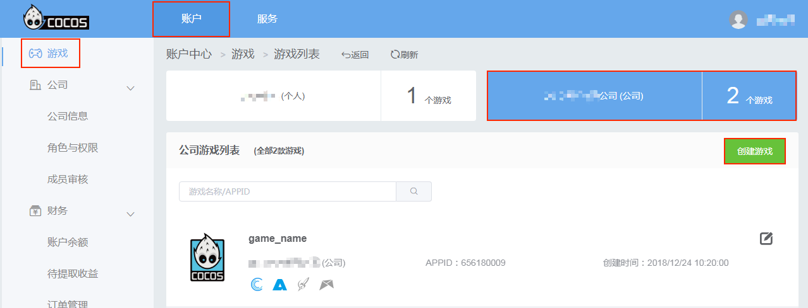
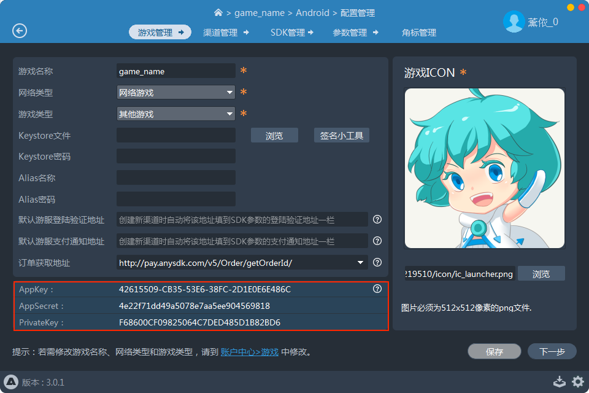
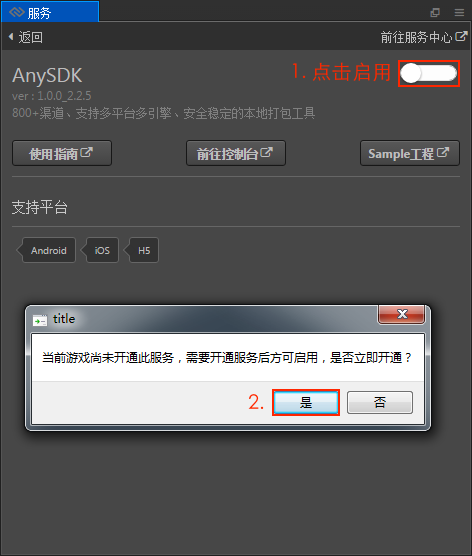
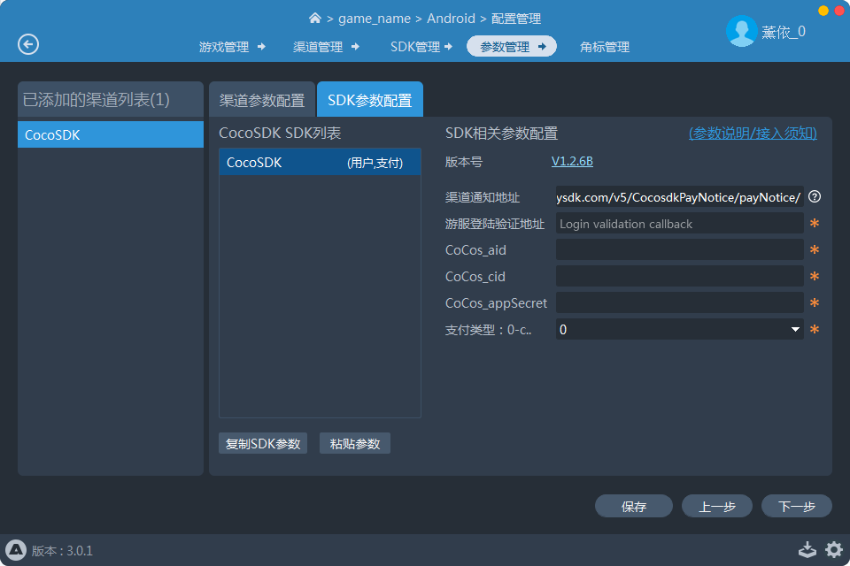

# 接入 AnySDK 服务

**AnySDK** 为 CP 提供了一套第三方 SDK 接入解决方案，整个接入过程，不改变任何 SDK 的功能、特性、参数等，对于最终玩家而言是完全透明无感知的。目的是让 CP 商能有更多时间专注于游戏本身的品质。第三方 SDK 包括了渠道 SDK、用户系统、支付系统、广告系统、统计系统、分享系统等等。目前支持 Android／iOS／H5 平台，**注意**：H5 平台只支持渠道 SDK 接入，并且必须使用 AnySDK 企业版。详情可参考 [AnySDK 企业版](http://docs.anysdk.com/enterprise/overview/)。

本文档基于 **v2.0.7** 编写，若用户使用的版本在 v2.0.7 之前，请参考 [旧版本文档](https://github.com/cocos-creator/creator-docs/blob/3e87b0f25c73e74acdc316c141971c592fc8f982/zh/sdk/anysdk-overview.md)。

## 创建游戏

因为 AnySDK 服务仅支持公司账户下的游戏，所以需要先进入 [Cocos 账户中心](https://auth.cocos.com/#/)，点击侧边栏的 **公司** 标签。然后根据需要 **加入已有公司**／**创建新的公司**，详情请参考 [AnySDK 文档](http://docs.anysdk.com/rapid-experience/service-activation/#_2)。可通过以下两种方式创建游戏：

- **通过 Cocos 账户中心创建游戏**

    在 [Cocos 账户中心](https://auth.cocos.com/#/) 点击侧边栏的 **游戏**  标签，在 **游戏列表** 中选择右边公司的标签，然后点击 **创建游戏**。在创建游戏面板根据要求填写必须的参数，参数填写完成后点击 **提交**，游戏就创建成功了。

    

- **通过 AnySDK 客户端创建游戏**

    从 [AnySDK 官网](http://www.anysdk.com/downloads) 下载独立的 AnySDK 客户端来创建游戏和打包。登录 AnySDK 客户端，根据提示创建新游戏，可得到三个参数，后面会用到。详情请参考 [创建游戏](http://docs.anysdk.com/rapid-experience/service-activation/#2-anysdk)。

    

游戏创建完成后，需要 **开通 AnySDK 服务**。在 [Cocos 账户中心](https://account.cocos.com/#/game/game_list) 的游戏列表中点击游戏或者点击页面上方的 **服务** 标签，跳转到服务面板。在左侧选择对应的游戏，然后找到 AnySDK 服务，点击 **开通服务**，可以看到页面中的 AnySDK 服务显示 **已开通**。

## 服务端接入

如果游戏要接入用户和支付的话，需要游戏服务端处理登陆验证和支付验证相关逻辑。参考以下两篇文档进行接入：

- [统一登录验证](http://docs.anysdk.com/OauthLogin)  
- [订单支付通知](http://docs.anysdk.com/PaymentNotice)

## 客户端接入

### 构建项目

1、打开 Creator，点击菜单栏的 **面板 -> 服务** 项，打开 **服务** 面板。设置 Cocos AppID，注意要选择公司游戏。详情可参考 [Cocos 服务面板设置](cocos-services.md)。然后选择 **AnySDK** 项，进入 AnySDK 服务设置面板。

2、点击右上角的启用按钮以启用 AnySDK 服务。（如果在创建游戏步骤中没有开通 AnySDK 服务，那么在启用 AnySDK 服务的时候会弹出是否开通服务的提示框，根据提示进行操作即可。）

3、启用完成之后，服务面板就会显示 **正在安装**，安装完成后可以看到面板中新增了 **参数配置** 项，填入参数。

可通过以下三种方式获取参数：

- 点击 AnySDK 服务面板中的 **前往控制台**，进入 [AnySDK 开发者管理后台](http://dev.anysdk.com/) 以获取参数，如上图所示。
- 在 Cocos 账户中心开通 AnySDK 服务后，直接点击 **前往控制台**，进入 [AnySDK 开发者管理后台](http://dev.anysdk.com/) 以获取参数。
- 在 AnySDK 打包工具的 **配置管理 -> 游戏管理** 中获取参数

其中 `OauthLoginURL` 参数是填写游戏服务端用于登录验证的地址（如不接入用户可任意填写）。

4、参数设置完成之后点击 **保存**。然后打开 **构建发布** 面板根据用户需要选择平台进行构建编译。构建出来的发布包已经自动集成了 AnySDK 服务。  

### 调用各系统接口

根据游戏需求，参考以下文档来调用各个系统的接口。  

- [用户系统](http://docs.anysdk.com/UsersystemJS)  
- [支付系统](http://docs.anysdk.com/IapsystemJS)  
- [统计系统][1]
- [分享系统][2]
- [广告系统][3]
- [推送系统][4]
- [崩溃分析系统][5]
- [广告追踪系统](http://docs.anysdk.com/AdTrackingSystemJS)

[1]: http://docs.anysdk.com/AnalyticsSystem(JS)
[2]: http://docs.anysdk.com/ShareSystem(JS)
[3]: http://docs.anysdk.com/AdsSystem(JS)
[4]: http://docs.anysdk.com/PushSystem(JS)
[5]: http://docs.anysdk.com/CrashSystem(JS)

## 打包

使用 AnySDK 客户端打开游戏，为游戏添加渠道以及接入所需的 SDK，配置 SDK 的参数（需要自己上 SDK 的后台申请参数），选择游戏母包即可进行打包。具体内容请参考 [AnySDK 客户端使用手册](http://docs.anysdk.com/tool-using/package-tool/)。

- Android 平台 **编译** 生成的 APK 包将作为 AnySDK 客户端打包用的母包。
- iOS 平台 **构建** 生成的 Xcode 工程直接作为 AnySDK 客户端打包用的母工程。
- H5 平台无需打包，只需在 AnySDK 客户端添加渠道配置即可。

## 相关参考链接

- [Cocos 账户中心](https://auth.cocos.com/#/)
- [AnySDK 官方文档](http://docs.anysdk.com/)
- [AnySDK 开发者管理后台](http://dev.anysdk.com/)
- [AnySDK 客户端使用手册](http://docs.anysdk.com/tool-using/package-tool/)
- [AnySDK 服务开通](http://docs.anysdk.com/rapid-experience/service-activation/#_2)
- [AnySDK 统一登录验证](http://docs.anysdk.com/OauthLogin)  
- [AnySDK 订单支付通知](http://docs.anysdk.com/PaymentNotice)